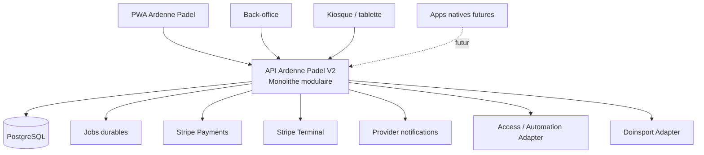
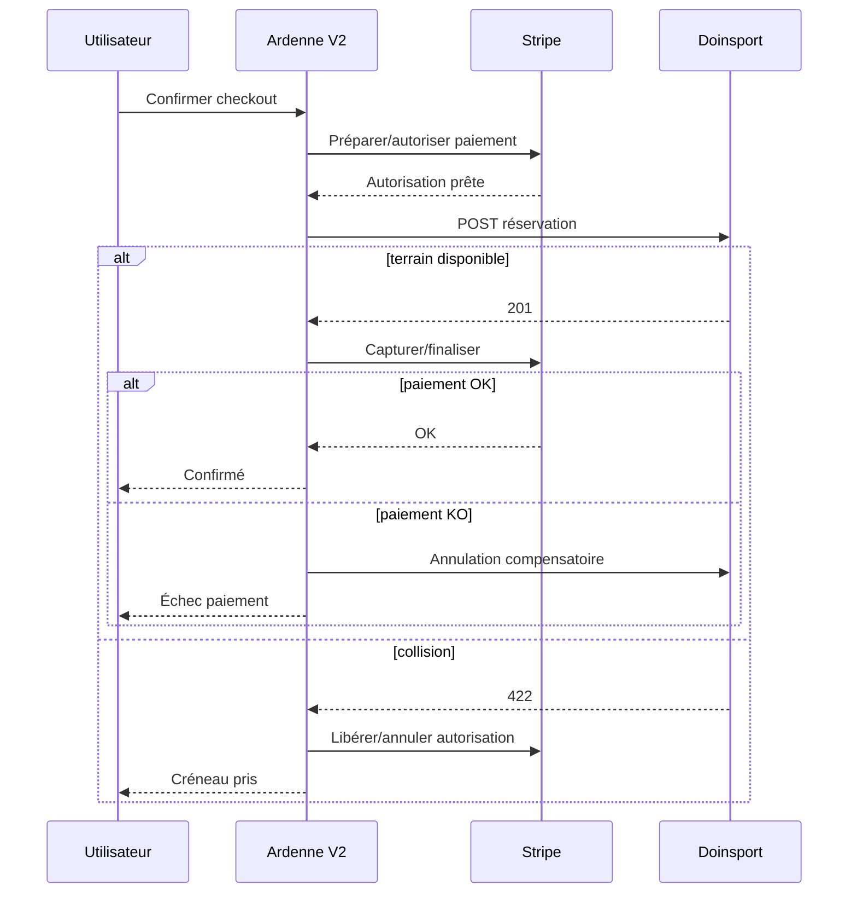
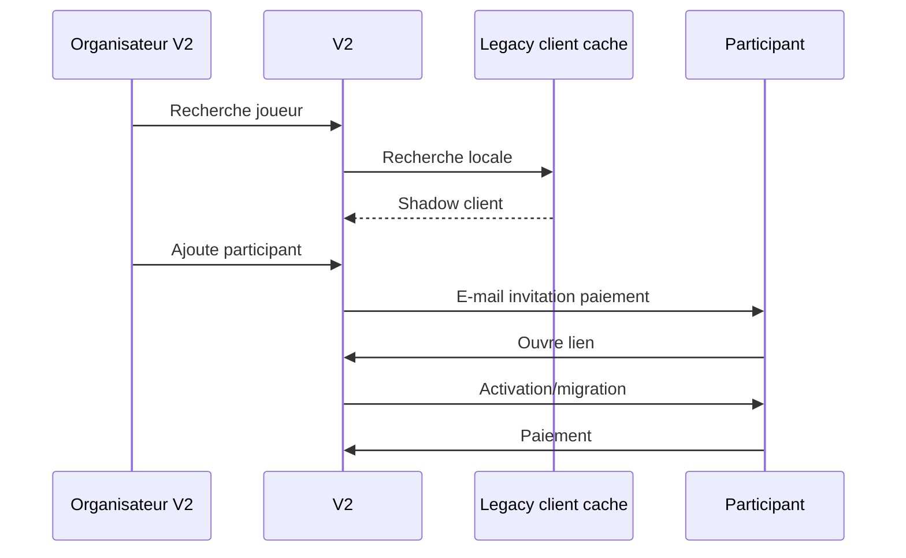

# Ardenne Padel V2 — Cahier des charges fonctionnel et technique complet

**Document destiné à Codex — développement intégral de la nouvelle plateforme Ardenne Padel**  
**Version : 1.1 — 13 août 2026**  
**Statut : Spécification de référence pour implémentation**  

### Évolution v1.1 — architecture de paiement et crédits prépayés

Cette version intègre les décisions produit prises après l'étude des coûts et des parcours de paiement :

- paiement intégral privilégié par défaut ;
- maintien du paiement par participant comme service optionnel ;
- frais de service de répartition configurables ;
- support Stripe multi-canaux : online, QR handoff et Terminal ;
- support des moyens de paiement locaux activés dans Stripe ;
- borne/tablette au club avec paiement Terminal ou poursuite sur smartphone par QR ;
- Tap to Pay prévu comme option si un client Android/iOS/React Native compatible est déployé ;
- packs de crédits prépayés Ardenne Padel ;
- wallet fermé avec ledger, crédits payés/bonus et réservations de solde ;
- possibilité de garantir un split par carte réutilisable ou par crédits bloqués ;
- mesure du coût réel des paiements par canal et moyen ;
- règles de remboursement adaptées aux paiements externes et aux crédits.

---

## 0. Rôle de ce document

Ce document constitue la **spécification fonctionnelle et technique de référence** pour le développement de **Ardenne Padel V2**, plateforme propriétaire destinée à remplacer progressivement Doinsport.

Codex doit utiliser ce document comme **source de vérité produit et architecture**, conjointement avec :

- `API-CATALOG.md` : catalogue audité des API Doinsport ;
- le code d'audit existant (`doinsport.js`, `refresh-doin-token.js`, `court-map.js`, `db.js`, `booking-db.js`, `sync.js`, `sync-all.js`) ;
- les variables d'environnement déjà disponibles ;
- les éventuelles ADR créées au cours du développement.

En cas d'ambiguïté :

1. ne pas inventer silencieusement une règle métier ;
2. privilégier le comportement décrit dans ce document ;
3. préserver la compatibilité avec le parcours Doinsport lorsque le document l'exige ;
4. documenter toute décision structurante dans un ADR ;
5. implémenter une solution simple, testable et réversible plutôt qu'une architecture prématurément complexe.

---

# 1. Vision produit

Ardenne Padel V2 doit devenir la plateforme centrale du club pour :

- la gestion des utilisateurs ;
- la consultation des disponibilités ;
- la réservation des terrains ;
- la gestion des participants ;
- la tarification ;
- les paiements ;
- les wallets/crédits ;
- les annulations et remboursements ;
- les notifications ;
- les codes d'accès ;
- la supervision back-office ;
- la migration progressive depuis Doinsport.

La plateforme doit être conçue pour permettre ultérieurement l'ajout de nouveaux modules sans devoir réécrire le cœur : application native, fidélité, communauté, compétitions, statistiques, automatisation du club, services vidéo, etc.

**Ces extensions futures ne font pas partie du MVP**, sauf les points d'extension explicitement prévus dans l'architecture.

---

# 2. Principes directeurs

## 2.1. Parité fonctionnelle avant enrichissement

La première version doit reprendre les fonctions nécessaires pour remplacer le parcours Doinsport utilisé aujourd'hui.

Le projet ne doit pas retarder la migration en développant trop tôt des fonctions secondaires.

Priorité :

1. réserver ;
2. payer ;
3. inviter ;
4. annuler/rembourser ;
5. accéder au club ;
6. administrer ;
7. synchroniser avec Doinsport pendant la transition.

## 2.2. Migration progressive, pas de Big Bang

Doinsport et Ardenne Padel V2 doivent pouvoir fonctionner simultanément pendant une période transitoire.

Pendant le **Dual Run** :

- les utilisateurs Legacy peuvent continuer à réserver via Doinsport ;
- les utilisateurs migrés réservent via Ardenne Padel V2 ;
- toute réservation créée depuis V2 est également créée dans Doinsport ;
- Doinsport reste temporairement l'autorité commune garantissant qu'un terrain n'est pas réservé deux fois ;
- les paiements V2 sont indépendants de Doinsport ;
- la V2 conserve son propre modèle de données et ses propres identifiants ;
- Doinsport est isolé derrière un adaptateur Legacy supprimable après migration.

## 2.3. Monolithe modulaire

Ne pas démarrer par des microservices.

L'architecture cible initiale est un **monolithe modulaire** avec frontières métier explicites.

Modules :

- Identity
- Users
- Social/Participants
- Courts
- Availability
- Pricing
- Booking
- Payments
- Wallet
- Notifications
- Access
- Administration
- Legacy Doinsport
- Audit/Observability

Chaque module expose des services/interfaces clairs mais reste déployable dans la même application backend.

## 2.4. API-first

Le frontend ne doit pas contenir de logique métier critique.

Toute fonction métier passe par une API backend stable.

L'API doit pouvoir être réutilisée ultérieurement par :

- la PWA ;
- une application Android ;
- une application iOS ;
- le back-office ;
- des outils internes autorisés.

## 2.5. Aucune dépendance métier directe à Doinsport

Le cœur du programme ne doit jamais manipuler directement les structures Doinsport.

Toutes les traductions sont confinées dans :

`LegacyDoinsportAdapter`

Les identifiants Doinsport sont conservés comme références externes, jamais comme clés primaires du domaine Ardenne Padel.

## 2.6. Pas de stockage de données carte

Ardenne Padel V2 ne doit jamais stocker :

- numéro complet de carte ;
- CVC ;
- cryptogramme ;
- données sensibles équivalentes.

La saisie des cartes est assurée par les composants sécurisés du prestataire de paiement.

---

# 3. Périmètre MVP

Le MVP indispensable au remplacement opérationnel de Doinsport comprend :

### Client

- création/activation de compte ;
- connexion ;
- récupération de mot de passe ;
- profil client ;
- consultation des disponibilités sans connexion ;
- choix simple/double ;
- choix date, heure et durée ;
- authentification avant finalisation ;
- ajout de participants ;
- paiement complet ou par participant ;
- frais de service configurable pour le paiement par participant ;
- Stripe online avec moyens de paiement locaux activables ;
- paiement par QR handoff depuis une borne ;
- Stripe Terminal au club ;
- wallet / crédits prépayés ;
- achat de packs de crédits ;
- garantie de split par carte réutilisable ou crédits réservés ;
- confirmation ;
- code d'accès ;
- e-mails ;
- annulation selon règles ;
- consultation de ses réservations.

### Administration

- calendrier des 4 terrains ;
- configuration terrains ;
- horaires ;
- durées autorisées ;
- tarifs ;
- création manuelle de réservation ;
- modification administrative ;
- annulation ;
- remboursement ;
- participants ;
- notes ;
- clients ;
- wallets ;
- paiements ;
- accès ;
- santé de synchronisation Doinsport.

### Technique

- Stripe Payments online ;
- Stripe Terminal ;
- QR handoff ;
- Payment Element / Checkout selon intégration retenue ;
- mesure des frais provider réels ;
- Doinsport Dual Run ;
- synchronisation Legacy ;
- contrôle d'accès via interface abstraite ;
- journal d'audit ;
- sauvegarde ;
- monitoring ;
- tests automatisés.

---

# 4. Hors périmètre MVP

Ne pas développer dans la première version sauf nécessité technique :

- réseau social complet ;
- messagerie instantanée ;
- marketplace ;
- moteur de recommandation ;
- gamification avancée ;
- ELO/XP ;
- tournois complexes ;
- computer vision ;
- coaching IA ;
- caisse/restaurant complète ;
- native Android/iOS ;
- microservices ;
- event streaming distribué ;
- data warehouse ;
- moteur de règles générique excessivement abstrait.

L'architecture doit permettre leur ajout futur sans les implémenter maintenant.

---

# 5. Terminologie

| Terme | Définition |
|---|---|
| V2 | Ardenne Padel V2 |
| Legacy | Système Doinsport existant |
| Dual Run | Période durant laquelle V2 et Doinsport cohabitent |
| Organisateur | Utilisateur qui crée la réservation |
| Participant | Joueur associé à une réservation |
| Client Legacy | Client présent dans Doinsport |
| Utilisateur migré | Client disposant d'un compte local V2 actif |
| Shadow Client | Référence locale minimale vers un client Doinsport non encore migré |
| Court | Terrain |
| Simple | Terrain prévu pour 2 joueurs |
| Double | Terrain prévu pour 4 joueurs |
| Wallet | Solde de crédits interne V2, fermé à l'écosystème Ardenne Padel |
| Crédit | Unité interne ; principe initial 1 crédit = 1 EUR |
| Credit Pack | Pack de crédits prépayés acheté par le client |
| Payment Mode | FULL ou SPLIT |
| Payment Channel | ONLINE, QR_HANDOFF ou TERMINAL |
| Split Service Fee | Prix du service optionnel de répartition du paiement |
| Wallet Hold | Crédits temporairement réservés comme garantie |
| Kiosk | Tablette/appareil enregistré utilisé au club |
| Booking | Réservation |
| Legacy Booking | Réservation Doinsport |
| Access Code | Code 4 chiffres + `#` associé à une réservation |

---

# 6. Architecture cible



## 6.1. Stack de référence

Sauf contrainte forte découverte dans le repository existant :

- TypeScript pour le backend et le frontend ;
- frontend React/Next.js en PWA mobile-first ;
- backend Node.js TypeScript avec framework structuré ;
- PostgreSQL comme base principale ;
- migrations de schéma versionnées ;
- API REST `/api/v1/...` ;
- OpenAPI générée/documentée ;
- tests unitaires, intégration et E2E Playwright ;
- déploiement conteneurisé ;
- reverse proxy HTTPS ;
- secrets exclusivement via environnement/secret store.

L'implémentation exacte peut être ajustée si le repository impose déjà un framework cohérent, mais les frontières fonctionnelles décrites ici doivent être conservées.

## 6.2. File de jobs

Le MVP a besoin de jobs durables pour :

- invitations ;
- rappels ;
- régularisation des impayés ;
- synchronisation Doinsport ;
- réconciliation ;
- provisioning/retrait des codes d'accès ;
- notifications ;
- retries.

Éviter une infrastructure distribuée disproportionnée.

Une queue durable adossée à PostgreSQL est acceptable pour le MVP.

---

# 7. Modèle d'identité

## 7.1. Données utilisateur minimales

Chaque utilisateur V2 possède :

- `id` UUID local ;
- prénom ;
- nom ;
- e-mail normalisé ;
- GSM normalisé ;
- statut du compte ;
- date de création ;
- date de dernière connexion ;
- préférences de notification ;
- référence Legacy éventuelle ;
- référence Stripe éventuelle.

## 7.2. Authentification locale

Le système doit supporter :

- e-mail + mot de passe ;
- vérification d'e-mail ;
- reset de mot de passe ;
- session persistante sécurisée ;
- déconnexion de toutes les sessions.

Les mots de passe doivent être hashés avec un algorithme moderne de dérivation robuste.

Ne jamais stocker de mot de passe Doinsport.

## 7.3. Migration des clients Doinsport

L'audit fourni confirme un **login club Doinsport**, pas un endpoint d'authentification joueur.

Le MVP doit donc fonctionner même sans authentification Legacy du joueur.

### Stratégie recommandée

1. synchroniser les fiches clients Doinsport minimales ;
2. créer des `ShadowClient` ;
3. envoyer une invitation de migration à l'adresse e-mail connue ;
4. le joueur clique sur un lien unique à durée limitée ;
5. l'e-mail est considéré comme vérifié par possession du lien ;
6. le joueur choisit son mot de passe V2 ;
7. le Shadow Client est lié au nouvel utilisateur local ;
8. conserver `legacy_client_id`.

Si une API d'authentification joueur Doinsport est confirmée ultérieurement, elle peut être ajoutée derrière une interface `LegacyIdentityVerifier` sans modifier le modèle utilisateur.

## 7.4. États de migration

```text
LEGACY_ONLY
INVITED
MIGRATION_PENDING
MIGRATED
DISABLED
MERGE_REQUIRED
```

## 7.5. Déduplication

L'association d'un compte Legacy et d'un compte local ne doit jamais se faire uniquement sur le nom.

Priorité :

1. lien de migration sécurisé ;
2. e-mail exact normalisé ;
3. validation manuelle administrateur en cas de conflit ;
4. GSM comme signal secondaire.

Tout conflit doit passer en `MERGE_REQUIRED`.

---

# 8. Rôles et autorisations

Rôles minimaux :

### CUSTOMER
- gérer son compte ;
- consulter les disponibilités ;
- réserver ;
- gérer ses participants ;
- payer ;
- annuler selon règle ;
- consulter ses propres réservations.

### STAFF
- voir calendrier club ;
- créer réservation ;
- consulter clients ;
- ajouter notes ;
- actions opérationnelles limitées.

### ADMIN
- toutes fonctions STAFF ;
- gestion tarifs ;
- horaires ;
- wallets ;
- remboursements ;
- accès ;
- synchronisation ;
- reporting opérationnel.

### SUPER_ADMIN
- configuration système ;
- gestion des rôles ;
- paramètres sensibles ;
- maintenance.

Toutes les actions administratives sensibles sont journalisées.

---

# 9. Terrains

Configuration initiale :

- Padel 1 — simple ;
- Padel 2 — simple ;
- Padel 3 — double ;
- Padel 4 — double.

Ne jamais baser la logique uniquement sur le nom du terrain.

Table `courts` :

- `id`
- `name`
- `slug`
- `court_type`
- `capacity`
- `active`
- `display_order`
- `legacy_playground_id`
- métadonnées optionnelles.

Capacité par défaut :

- simple : 2 ;
- double : 4.

---

# 10. Horaires et disponibilité

## 10.1. Règles locales V2

V2 doit posséder son propre moteur simple de disponibilités.

Concepts :

### OpeningRule
- jour de semaine ;
- heure début ;
- heure fin ;
- période de validité ;
- terrain ou groupe de terrains.

### CourtClosure
- terrain ;
- début ;
- fin ;
- motif ;
- type : maintenance, événement, blocage admin.

### DurationRule
- terrain/type de terrain ;
- plage horaire ;
- durées autorisées ;
- validité.

## 10.2. Consultation

Un utilisateur non connecté doit pouvoir :

1. sélectionner simple ou double ;
2. choisir une date ;
3. voir les créneaux ;
4. choisir une heure ;
5. choisir une durée autorisée.

## 10.3. Source de vérité durant le Dual Run

Pendant `LEGACY_DUAL_RUN=true` :

- les règles V2 déterminent ce qui est commercialisable ;
- les réservations Doinsport sont intégrées comme occupations externes ;
- les réservations V2 sont intégrées comme occupations internes ;
- un créneau n'est disponible que si aucune source ne l'occupe.

Le calendrier peut utiliser un cache court, mais la disponibilité affichée n'est jamais une garantie.

La **création Doinsport finale** constitue l'arbitre anti-collision pendant le Dual Run.

## 10.4. Après coupure Doinsport

V2 devient l'unique source de vérité.

La base PostgreSQL doit alors empêcher au niveau transactionnel les réservations actives incompatibles sur un même terrain et une plage qui se chevauche.

---

# 11. Tarification locale

V2 doit posséder son propre moteur de prix dès le départ afin de ne pas dépendre éternellement de Doinsport.

## 11.1. TariffRule

Champs :

- `id`
- nom
- actif
- terrain ou type de terrain
- date début/fin de validité
- jours de semaine
- heure début/fin
- durée
- prix total ou prix/participant
- capacité de référence
- priorité explicite
- tags internes éventuels
- date création/modification.

## 11.2. Résolution

Le moteur local doit produire de façon déterministe :

- prix total ;
- prix par participant ;
- règle appliquée ;
- devise ;
- ventilation éventuelle.

La priorité doit être explicite, pas implicite via `createdAt`.

## 11.3. Doinsport pendant migration

Le prix facturé au client est calculé par V2.

Le `LegacyDoinsportAdapter` résout indépendamment le `timetableBlockPriceId` nécessaire au POST Legacy.

Le prix Legacy retourné doit être comparé au prix V2.

En cas d'écart supérieur à la tolérance configurée :

- log `PRICE_MISMATCH` ;
- remonter une alerte ;
- ne jamais modifier silencieusement le montant Stripe déjà affiché.

---

# 12. Intégration Doinsport — principes

L'audit `API-CATALOG.md` est la référence des endpoints validés.

Le code existant d'audit ne doit pas être jeté sans raison.

Créer un module :

`modules/legacy-doinsport`

avec une interface stable.

## 12.1. Interface logique

```ts
interface LegacyBookingProvider {
  authenticateClub(): Promise<LegacyAuth>;
  listClients(): Promise<LegacyClient[]>;
  listBookings(range: DateRange): Promise<LegacyBookingSummary[]>;
  getBooking(id: string): Promise<LegacyBooking>;
  listCourts(): Promise<LegacyCourt[]>;
  resolveLegacyPrice(input: LegacyPriceInput): Promise<LegacyPriceReference>;
  createBooking(input: LegacyCreateBooking): Promise<LegacyBooking>;
  cancelBooking(id: string, options: LegacyCancelOptions): Promise<LegacyBooking>;
}
```

Le reste du code ne doit pas connaître les endpoints HTTP Doinsport.

---

# 13. API Doinsport confirmées à exploiter

## 13.1. Authentification club

```http
POST /club_login_check
Content-Type: application/json
```

Retourne un JWT court.

Requirements :

- refresh automatique ;
- sur 401 : un refresh + un seul retry ;
- secrets hors base métier ;
- token jamais loggé ;
- surveiller `exp`.

Le `userClubId` doit être déterminé de manière robuste.

L'audit mentionne une divergence historique entre une valeur d'environnement et l'ID présent dans le JWT.

**Exigence :** dériver préférentiellement l'identifiant du contexte d'authentification confirmé ; ne pas hardcoder une valeur sans validation au démarrage.

## 13.2. Clients

```http
GET /clubs/clients?club.id={CLUB_ID}&itemsPerPage=200&page=N&getTotalItems=true
```

Normaliser :

- id ;
- firstName ;
- lastName ;
- email ;
- gsm.

Ne pas exposer `raw` aux clients frontend.

## 13.3. Réservations

Listing :

```http
GET /clubs/bookings/listing
```

Détail :

```http
GET /clubs/bookings/{id}
```

Attention : les filtres `startAt[after]` / `startAt[before]` du listing ont été observés comme non fiables.

Le filtre temporel doit être réappliqué localement.

## 13.4. Terrains

```http
GET /clubs/playgrounds/{playgroundId}
GET /clubs/playgrounds?club.id={CLUB_ID}&itemsPerPage=10&page=1
```

## 13.5. Tarifs

```http
GET /clubs/playgrounds/timetables/blocks/prices
GET /clubs/playgrounds/timetables
GET /clubs/playgrounds/timetables/blocks/{blockId}
GET /clubs/playgrounds/timetables/blocks
```

Conserver dans l'adapter l'algorithme audité :

1. récupérer timetables du terrain ;
2. récupérer blocks ;
3. sélectionner les blocks couvrant l'heure ;
4. trier par `createdAt` décroissant ;
5. chercher dans cet ordre un block proposant la durée demandée ;
6. résoudre le price object correspondant.

Cette règle est Legacy uniquement et ne doit pas contaminer le moteur tarifaire V2.

## 13.6. Création

```http
POST /clubs/bookings
Content-Type: application/json
```

La création confirmée utilise des IRI API Platform.

Payload de référence :

```json
{
  "id": null,
  "name": null,
  "startAt": "<ISO>",
  "endAt": "<ISO>",
  "activity": "/activities/<activityId>",
  "category": null,
  "timetableBlockPrice": "/clubs/playgrounds/timetables/blocks/prices/<id>",
  "participants": [
    {
      "client": "/clubs/clients/<clientId>",
      "subscriptionCard": null,
      "category": null,
      "inQueue": false,
      "bookingOwner": true
    }
  ],
  "comment": "<external correlation marker>",
  "clientNote": null,
  "playgrounds": ["/clubs/playgrounds/<playgroundId>"],
  "recurrence": null,
  "fromRecurrence": null,
  "participantsQueueEnabled": false,
  "client": null,
  "club": "/clubs/<CLUB_ID>",
  "creationOrigin": "administration",
  "paymentMethod": "on_the_spot",
  "playgroundOptions": [],
  "nameManuallyUpdated": null,
  "coachVisibleOnline": null,
  "minAgeLimitation": null,
  "maxAgeLimitation": null,
  "userClub": "/user-clubs/<userClubId>"
}
```

`paymentMethod: "on_the_spot"` a été validé comme permettant la création sans paiement Doinsport.

## 13.7. Collision

Une tentative sur terrain déjà occupé retourne un `422` avec violation sur `playgrounds`.

Le frontend V2 doit convertir cela en message utilisateur :

> Ce créneau vient d'être réservé. Veuillez sélectionner un autre horaire.

## 13.8. Annulation

```http
PUT /clubs/bookings/{bookingId}
Content-Type: application/json

{
  "canceled": true,
  "withRefund": true
}
```

Avant production, tester explicitement le comportement `withRefund:false` pour les réservations V2 payées par Stripe.

V2 doit gérer ses remboursements Stripe indépendamment.

---

# 14. Mapping Legacy

Ne pas disperser des UUID Doinsport dans le code.

Tables/configuration :

### legacy_court_mapping
- local_court_id
- legacy_playground_id
- legacy_activity_id
- active

### legacy_user_mapping
- user_id ou shadow_client_id
- legacy_client_id
- sync_status

### legacy_booking_mapping
- booking_id
- legacy_booking_id
- sync_status
- last_sync_at
- last_error

Le mapping initial audité doit être utilisé comme seed/configuration, pas comme constantes métier profondes.

---

# 15. Synchronisation Doinsport → V2

## 15.1. Objectif

Détecter les réservations créées directement dans Doinsport par les utilisateurs Legacy.

## 15.2. Absence de webhook confirmé

Le catalogue ne confirme aucun webhook temps réel.

Le MVP doit fonctionner par polling configurable.

## 15.3. Stratégie

Deux niveaux :

### Sync fréquente
- réservations futures pertinentes ;
- intervalle configurable ;
- valeur initiale recommandée : 60 s ;
- ne pas descendre agressivement sans connaître les rate limits.

### Réconciliation complète
- périodique ;
- compare les réservations futures V2 et Doinsport ;
- intervalle configurable ;
- typiquement plusieurs minutes.

## 15.4. On-demand refresh

Avant une finalisation de réservation V2 :

1. revalider l'état local ;
2. tenter la création Doinsport ;
3. traiter `422` comme collision finale.

Cette règle protège contre un calendrier légèrement en retard.

---

# 16. Idempotence et timeouts Legacy

L'idempotence Doinsport n'est pas confirmée.

V2 doit donc ajouter sa propre stratégie.

## 16.1. Clé de corrélation

Chaque réservation V2 a un UUID dès le début.

Lors de la création Doinsport, inclure si possible un marqueur :

`APV2:<booking_uuid>`

dans un champ Legacy non destructif tel que `comment`.

Avant activation production, vérifier que ce marqueur :

- est conservé ;
- est lisible dans le détail ;
- n'est pas exposé de manière gênante au client.

## 16.2. Timeout après POST

Ne pas rejouer immédiatement un POST à l'aveugle.

Procédure :

1. statut local `LEGACY_CONFIRMATION_UNKNOWN` ;
2. rechercher les réservations Legacy correspondant au terrain, horaire et client ;
3. lire leur détail ;
4. rechercher le marqueur APV2 ;
5. si trouvé : lier la réservation et continuer ;
6. si absent : autoriser un retry contrôlé ;
7. si ambigu : `MANUAL_REVIEW`.

---

# 17. Machine à états réservation

Statuts principaux :

```text
DRAFT
CHECKOUT_PENDING
LEGACY_HOLD_PENDING
PAYMENT_PENDING
CONFIRMED
CANCEL_PENDING
CANCELED
COMPLETED
FAILED
MANUAL_REVIEW
```

Sous-état sync Legacy :

```text
NOT_REQUIRED
PENDING
CONFIRMED
CONFIRMATION_UNKNOWN
FAILED
CANCEL_PENDING
CANCELED
```

Sous-état paiement :

```text
NONE
PENDING
PARTIALLY_PAID
PAID
GUARANTEE_ACTIVE
FAILED
REFUND_PENDING
PARTIALLY_REFUNDED
REFUNDED
AMOUNT_DUE
```

Mode de paiement :

```text
FULL
SPLIT
```

Canal externe :

```text
ONLINE
QR_HANDOFF
TERMINAL
```

Type de garantie split :

```text
CARD_OFF_SESSION
WALLET_RESERVE
```

Ne jamais déduire un état financier uniquement de l'état Legacy.

---

# 18. Création d'une réservation — parcours client

## 18.1. Navigation initiale

1. ouvrir la PWA ;
2. choisir `Simple` ou `Double` ;
3. afficher le calendrier du jour ;
4. permettre changement de date ;
5. afficher créneaux disponibles ;
6. sélectionner un début ;
7. sélectionner une durée ;
8. afficher prix ;
9. proposer le wallet si disponible ;
10. proposer `FULL` par défaut ou `SPLIT` en option ;
11. afficher tout frais de service avant validation ;
12. poursuivre vers paiement/garantie.

## 18.2. Authentification tardive

L'utilisateur peut consulter les disponibilités sans compte.

Avant de choisir les participants/payer :

- s'il est connecté : continuer ;
- sinon : login ;
- ou création/activation de compte ;
- après authentification : reprendre le checkout exactement où il était.

Le panier de réservation doit survivre à l'authentification.

## 18.3. Participants

L'organisateur peut :

- ne choisir personne immédiatement ;
- ajouter des amis ;
- rechercher un joueur ;
- associer jusqu'à la capacité du terrain.

Une place vide reste une place financièrement sous responsabilité de l'organisateur si paiement partagé.

---

# 19. Recherche joueurs

## 19.1. Sources

La recherche peut porter sur :

- utilisateurs V2 ;
- Shadow Clients Legacy.

## 19.2. Données exposées

Résultat minimal :

- prénom ;
- nom ;
- avatar éventuel futur ;
- statut « déjà sur Ardenne Padel » ou « invitation nécessaire ».

Ne jamais exposer publiquement :

- e-mail complet ;
- téléphone ;
- données de paiement.

## 19.3. Performance

Ne pas appeler `getClients()` Doinsport à chaque frappe.

Synchroniser les clients Legacy côté serveur et rechercher dans la base locale.

---

# 20. Amis

Le MVP peut conserver un modèle simple :

### friendship
- requester_user_id
- addressee_user_id
- status
- created_at

Statuts :

- PENDING
- ACCEPTED
- BLOCKED

Toutefois, la réservation ne doit pas dépendre de l'existence d'une relation d'amitié.

La recherche globale autorisée doit continuer à fonctionner selon les règles de confidentialité retenues.

---

# 21. Paiement — architecture et stratégie

Le module `Payments` doit couvrir trois objectifs simultanés :

1. garantir un checkout simple pour les clients belges et étrangers ;
2. conserver le paiement par participant sans en faire le parcours par défaut ;
3. réduire le coût moyen de paiement en favorisant les paiements groupés, le Terminal et les crédits prépayés.

Le domaine Booking ne doit jamais dépendre directement du SDK Stripe.

## 21.1. Abstraction provider

```ts
interface PaymentProvider {
  createCustomer(...): Promise<PaymentCustomerRef>;
  createSetup(...): Promise<SetupRef>;
  createPayment(...): Promise<PaymentRef>;
  confirmOrCapture(...): Promise<PaymentRef>;
  refund(...): Promise<RefundRef>;
  chargeSavedMethod(...): Promise<PaymentRef>;
  getActualProviderFee?(...): Promise<ProviderFeeRef>;
}
```

Adapter initial : `StripePaymentProvider`.

Le design doit permettre de remplacer ou compléter Stripe ultérieurement sans réécrire le Booking Engine.

## 21.2. Distinguer trois concepts

Ne pas confondre :

### `payment_mode`
Répartition commerciale de la réservation :

```text
FULL
SPLIT
```

### `payment_channel`
Canal par lequel le paiement externe est initié :

```text
ONLINE
QR_HANDOFF
TERMINAL
```

`QR_HANDOFF` reste techniquement un paiement online, mais doit être distingué pour mesurer l'usage du kiosque.

### `payment_method_type`
Moyen réellement utilisé, remonté par le provider :

- card ;
- Bancontact ;
- iDEAL / iDEAL|Wero selon disponibilité Stripe ;
- Apple Pay / Google Pay lorsque exposés par Stripe ;
- autres moyens locaux autorisés ;
- wallet Ardenne Padel.

Ne pas coder une logique métier par nationalité.

## 21.3. Rationale économique — informatif, non contractuel

À la date de rédaction, la tarification Stripe Standard Belgique montre notamment :

- carte EEE standard online : `1,5 % + 0,25 €` ;
- carte EEE via Terminal : `1,4 % + 0,10 €` ;
- Tap to Pay : supplément par autorisation ;
- Bancontact : tarification fixe publiée par Stripe.

Ces chiffres expliquent les choix d'architecture mais **ne doivent jamais être hardcodés dans le moteur métier**, car ils peuvent évoluer ou être remplacés par une tarification négociée.

Le système doit enregistrer, lorsqu'elle est disponible, la **commission provider réellement facturée** afin de calculer le coût de paiement réel.

## 21.4. Principe produit

Le checkout doit favoriser :

1. **crédits Ardenne Padel**, lorsque le solde est suffisant ;
2. **paiement intégral** de la réservation ;
3. paiement par participant uniquement comme option secondaire.

Cette hiérarchie est une règle UX, pas une interdiction technique.

---

# 22. Canaux de paiement Stripe

## 22.1. ONLINE

Pour un client sur smartphone, ordinateur ou application :

- utiliser Stripe Payment Element / Checkout ou composant Stripe équivalent ;
- activer les moyens locaux pertinents dans Stripe ;
- laisser Stripe gérer l'authentification forte et le parcours du moyen de paiement ;
- ne jamais collecter directement PAN/CVC dans le backend Ardenne Padel.

Le système doit pouvoir exposer les moyens activés dans Stripe sans changement du Booking Engine.

## 22.2. QR_HANDOFF

Cas d'usage principal : tablette/kiosque Ardenne Padel.

Flux :

1. le client choisit terrain/date/heure/durée sur la tablette ;
2. le serveur crée une `kiosk_checkout_session` temporaire ;
3. la tablette affiche un QR contenant uniquement une URL opaque/signée ;
4. le client scanne le QR avec son téléphone ;
5. le smartphone reprend exactement le checkout en cours ;
6. authentification/activation du compte si nécessaire ;
7. paiement online via les moyens Stripe disponibles ;
8. la tablette reçoit/polle l'état et affiche la confirmation.

Le QR ne doit jamais embarquer de donnée bancaire ou secret durable.

La session doit avoir :

- token aléatoire ;
- expiration courte configurable ;
- statut ;
- booking draft associé ;
- protection contre réutilisation ;
- possibilité d'annulation/expiration automatique.

## 22.3. TERMINAL

Lorsqu'un client est physiquement au club, la tablette doit pouvoir proposer :

> **Payer ici par carte / sans contact**

Le paiement est alors collecté via Stripe Terminal avec un lecteur compatible.

Le paiement Terminal reste relié :

- au même utilisateur ;
- au même booking ;
- au même `Payment` V2 ;
- au même Stripe Customer si applicable.

Le canal `TERMINAL` est utilisé uniquement lorsqu'un véritable lecteur / mécanisme Stripe Terminal collecte physiquement le moyen de paiement.

Il est interdit de tenter de classer artificiellement un paiement web comme `card_present`.

## 22.4. Terminal matériel — MVP recommandé

Le MVP borne doit privilégier :

```text
PWA tablette
+
lecteur Stripe Terminal
+
QR handoff
```

Le modèle précis de lecteur doit être choisi parmi les matériels Stripe disponibles/compatibles au moment de l'achat.

Ne pas coupler le domaine à un modèle de lecteur précis.

## 22.5. Tap to Pay

Tap to Pay est une option intéressante mais ne doit pas être supposé disponible dans une simple PWA navigateur.

Le support Stripe repose sur des SDK compatibles Android/iOS/React Native.

Par conséquent :

- le MVP web peut fonctionner avec lecteur Terminal physique ;
- Tap to Pay peut être activé si un petit client natif/kiosk compatible est ajouté ;
- le Booking Engine et le modèle Payment restent inchangés.

## 22.6. Mode kiosque

Créer un concept `registered_device` / `kiosk_device`.

Un appareil déclaré `CLUB_KIOSK` peut afficher :

```text
[PAYER ICI]
→ Stripe Terminal

[CONTINUER SUR MON TÉLÉPHONE]
→ QR handoff
```

Les clients à distance ne voient pas les actions Terminal.

---

# 23. Modes de paiement d'une réservation

## 23.1. Paiement complet — `FULL`

C'est le mode **sélectionné par défaut** dans le checkout.

L'organisateur paie 100 % du prix dû.

Les participants peuvent être associés à la réservation sans obligation de paiement.

Moyens possibles :

- wallet Ardenne Padel ;
- wallet + paiement externe du solde restant ;
- Stripe online ;
- QR handoff ;
- Stripe Terminal lorsqu'au club.

UX recommandée :

> **Je paie l'intégralité de la réservation**

Ce mode n'entraîne aucun frais de service de répartition.

## 23.2. Paiement par participant — `SPLIT`

Ce mode reste proposé pour conserver la fonctionnalité connue des utilisateurs Doinsport, mais il est présenté comme une option secondaire.

UX recommandée :

> **Chaque joueur paie sa participation**

Afficher clairement avant validation :

- chaque participant doit disposer ou créer un compte Ardenne Padel ;
- l'organisateur reste garant des parts impayées ;
- un frais de service de répartition peut être appliqué ;
- l'organisateur doit disposer d'une garantie valide : carte réutilisable ou crédits disponibles suffisants.

## 23.3. Calcul des parts

Simple :

- capacité de référence : 2 ;
- part de base = prix terrain / 2.

Double :

- capacité de référence : 4 ;
- part de base = prix terrain / 4.

Le calcul doit utiliser des centimes entiers et gérer explicitement les éventuels centimes résiduels.

## 23.4. Participants

Chaque participant peut payer sa part avec :

- wallet ;
- paiement online ;
- QR handoff ;
- paiement Terminal si un parcours au club le permet.

Le fait qu'un participant utilise son wallet ne rend pas automatiquement le split gratuit au niveau de la réservation : le frais éventuel rémunère le **service de répartition**, pas chaque transaction individuelle.

---

# 24. Frais de service du paiement partagé

## 24.1. Principe

Le mode `SPLIT` peut entraîner un **frais de service de répartition** configurable.

Ce frais rémunère une fonctionnalité distincte :

- création des parts ;
- invitations ;
- suivi individuel ;
- relances ;
- gestion des statuts ;
- garantie organisateur ;
- régularisation des impayés.

Il ne doit jamais être présenté comme :

- « frais Stripe » ;
- « frais de carte » ;
- « supplément Visa/Mastercard » ;
- « frais de paiement électronique ».

## 24.2. Configuration initiale

Prévoir :

```text
split_service_fee_enabled = true|false
split_service_fee_cents = 100
split_service_fee_allocation = ORGANIZER|PRO_RATA
```

Valeur commerciale initiale proposée :

```text
1,00 € / réservation en mode SPLIT
```

La valeur doit être modifiable depuis le back-office/configuration sans déploiement.

Politique initiale recommandée :

```text
allocation = ORGANIZER
```

car l'organisateur choisit d'activer ce service.

Le mode `PRO_RATA` reste supportable ultérieurement sans modifier le modèle.

## 24.3. Indépendance du moyen de paiement

Le montant du service de répartition ne doit pas varier selon que les joueurs utilisent :

- wallet ;
- carte ;
- Bancontact ;
- iDEAL ;
- autre moyen électronique.

Le prix du service est déterminé lors du choix `SPLIT` et snapshoté dans le booking.

## 24.4. Vigilance réglementaire

La réglementation belge interdit de facturer un supplément simplement parce qu'un client choisit un paiement électronique.

Avant activation en production du frais `SPLIT`, faire valider le wording et le traitement TVA/commercial afin de s'assurer qu'il constitue bien le prix d'un **service distinct de répartition**, et non une surcharge liée au moyen de paiement.

Prévoir un feature flag permettant de désactiver immédiatement ce frais sans désactiver le split.

## 24.5. Affichage

Le client doit connaître le prix avant confirmation.

Exemple :

```text
Terrain                         48,00 €
Service de paiement partagé     1,00 €
--------------------------------------
Total                          49,00 €
```

Si allocation `ORGANIZER` :

- organisateur supporte 1,00 € en plus de sa part ;
- les autres participants supportent uniquement leur part de terrain.

---

# 25. Garantie de l'organisateur pour le paiement partagé

Le créateur reste responsable du montant du terrain non payé par les autres participants.

Le système supporte deux mécanismes de garantie.

## 25.1. `CARD_OFF_SESSION`

L'organisateur dispose d'un moyen Stripe réutilisable autorisant un futur débit.

La carte doit être configurée via le workflow Stripe adapté (`SetupIntent` / usage futur off-session ou équivalent au moment de l'implémentation).

Conserver uniquement la référence Stripe.

Obtenir le consentement explicite :

> En choisissant le paiement par participant, j'accepte que les parts encore impayées à l'échéance puissent être débitées sur mon moyen de paiement enregistré.

Un futur débit peut toujours être refusé par l'émetteur.

En cas d'échec :

- `AMOUNT_DUE` ;
- notification organisateur ;
- notification admin ;
- action de paiement manuel ;
- audit.

## 25.2. `WALLET_RESERVE`

Si l'organisateur possède suffisamment de crédits, V2 peut réserver le montant correspondant aux parts potentiellement impayées.

Exemple double 48 € :

```text
Part organisateur payée : 12 crédits
Garantie réservée :       36 crédits
```

Les 36 crédits restent dans son wallet mais ne sont plus dépensables pour une autre réservation.

À mesure que les participants paient :

- libérer la garantie correspondante.

À l'échéance :

- convertir le montant encore réservé en débit définitif.

Ce mécanisme réduit la dépendance aux débits Stripe off-session.

## 25.3. Un seul mécanisme de garantie actif

Pour garder le MVP simple, une réservation split utilise un seul type de garantie :

```text
CARD_OFF_SESSION
ou
WALLET_RESERVE
```

Pas de combinaison automatique carte + wallet de garantie dans le MVP.

## 25.4. Données de garantie

Ajouter :

```text
booking_guarantee
- id
- booking_id
- type
- organizer_user_id
- guaranteed_amount
- remaining_guaranteed_amount
- wallet_hold_id nullable
- payment_method_id nullable
- status
- created_at
- released_at nullable
```

Statuts :

```text
ACTIVE
PARTIALLY_RELEASED
CONSUMED
RELEASED
FAILED
```

---

# 26. Booking shares et paiements invités

Après création d'une réservation `SPLIT` :

1. créer une part par place/participant ;
2. payer immédiatement la part organisateur + éventuel frais de service à sa charge ;
3. créer la garantie ;
4. envoyer un e-mail par participant restant ;
5. le participant ouvre un lien opaque ;
6. il active/crée son compte si nécessaire ;
7. il paie sa part ;
8. le share passe `PAID` ;
9. la garantie organisateur est diminuée/libérée à concurrence de cette part.

## 26.1. `booking_share`

Champs :

- `id`
- `booking_id`
- `participant_user_id nullable`
- `legacy_client_id nullable`
- `invited_email nullable`
- `base_amount`
- `service_fee_amount`
- `total_amount`
- `status`
- `funding_source`
- `paid_by_user_id nullable`
- `payment_id nullable`
- `wallet_transaction_id nullable`
- `due_at`
- `created_at`
- `paid_at nullable`.

Statuts :

```text
OPEN
INVITED
PAYMENT_PENDING
PAID
COVERED_BY_ORGANIZER
CANCELED
REFUNDED
```

## 26.2. Lien d'invitation

Le lien doit devenir inutilisable après :

- paiement ;
- annulation ;
- expiration ;
- fin de validité.

Double clic et webhooks dupliqués doivent être idempotents.

## 26.3. Compte obligatoire

Le paiement d'une part requiert un compte Ardenne Padel.

Un Shadow Client invité doit donc passer par l'activation/migration avant la validation de son paiement.

---

# 27. Orchestration paiement + Booking Legacy

Objectif : éviter :

- paiement externe réussi sans terrain ;
- terrain réservé sans paiement/garantie ;
- double réservation ;
- réservation orpheline après timeout.

Le workflow doit dépendre des capacités du moyen de paiement.

## 27.1. Carte permettant autorisation préalable

Séquence préférée :



## 27.2. Moyen à redirection/paiement immédiat ne supportant pas un hold adapté

Pour des moyens tels que certains paiements bancaires locaux :

1. créer d'abord une réservation Legacy temporairement confirmée ;
2. initier immédiatement le paiement ;
3. si succès : confirmer V2 ;
4. si abandon/échec/expiration : annuler la réservation Legacy ;
5. disposer d'un job de nettoyage fiable.

La durée maximale du checkout temporaire doit être configurable.

## 27.3. Wallet

Pour un paiement 100 % wallet :

1. vérifier/verrouiller le solde ;
2. créer la réservation Legacy ;
3. si 201 : débiter définitivement le wallet ;
4. si échec : libérer le hold.

## 27.4. Split

Pour `SPLIT` :

1. vérifier participants ;
2. vérifier/établir garantie ;
3. encaisser ou réserver la part organisateur ;
4. encaisser le frais de service éventuel ;
5. créer Legacy ;
6. finaliser part organisateur ;
7. envoyer invitations.

Toutes les compensations doivent être idempotentes.

---

# 28. Wallet et crédits prépayés Ardenne Padel

## 28.1. Positionnement produit

Le wallet devient un moyen de paiement de premier rang pour les joueurs réguliers.

Principe initial :

```text
1 crédit = 1,00 €
```

Le wallet est fermé à l'écosystème Ardenne Padel.

Dans le MVP :

- non transférable entre clients ;
- pas de retrait cash ;
- pas de paiement chez des tiers ;
- pas de P2P ;
- utilisation pour les services Ardenne Padel autorisés.

Cette simplicité doit être préservée tant qu'une évolution n'est pas nécessaire.

## 28.2. Packs de crédits

Créer `credit_pack`.

Exemple initial :

```text
100 € → 100 crédits
```

Le back-office doit permettre de créer d'autres packs :

```text
purchase_amount_cents
paid_credits_cents
bonus_credits_cents
active
sales_channels
valid_from
valid_until
display_order
```

Exemples futurs possibles :

```text
250 € → 250 crédits + bonus configuré
500 € → 500 crédits + bonus configuré
```

Aucun taux de remise/bonus ne doit être hardcodé.

## 28.3. Canaux de recharge

Un pack peut être acheté :

- au bar via Stripe Terminal ;
- online ;
- via QR handoff ;
- par crédit manuel admin autorisé.

Le parcours au bar doit mettre le Terminal en avant lorsque disponible afin de simplifier l'UX et, potentiellement, réduire le coût d'acquisition du paiement.

## 28.4. Ledger

Le wallet est un ledger immuable fonctionnellement, pas une simple colonne `balance`.

### `wallet_account`
- id
- user_id
- currency
- status.

### `wallet_transaction`
- id
- wallet_account_id
- type
- amount
- credit_origin
- booking_id nullable
- credit_pack_purchase_id nullable
- wallet_hold_id nullable
- reference
- created_by
- created_at
- metadata.

Types minimaux :

```text
CREDIT_PACK_PURCHASE
CREDIT_PACK_BONUS
CREDIT_ADMIN
DEBIT_BOOKING
REFUND_BOOKING
HOLD_CREATED
HOLD_RELEASED
HOLD_CAPTURED
ADJUSTMENT
BONUS_EXPIRY
```

## 28.5. Crédits payés et bonus

Distinguer dans le ledger :

```text
PAID
BONUS
ADMIN_COMP
```

afin de permettre :

- audit ;
- politiques d'expiration différentes ;
- restitution fidèle lors d'une annulation ;
- analyse comptable.

Politique initiale recommandée :

- crédits payés : pas d'expiration automatique dans le MVP ;
- bonus : expiration possible uniquement si explicitement configurée et affichée au client.

## 28.6. Holds / crédits réservés

Créer `wallet_hold`.

Champs :

- id
- wallet_account_id
- booking_id
- amount
- status
- expires_at nullable
- created_at
- captured_at nullable
- released_at nullable.

Calculer :

```text
balance_total
balance_reserved
balance_available
```

`balance_available` est le seul montant dépensable.

## 28.7. Paiement d'une réservation

Si le solde suffit, présenter en premier :

> **Utiliser mes crédits Ardenne Padel**

Support MVP :

- 100 % wallet ;
- wallet + moyen externe pour le solde restant.

## 28.8. Économie de transactions

Les débits wallet ne créent pas de nouvelle transaction Stripe.

Une réservation split peut donc générer :

- 0 transaction externe si tous utilisent des crédits ;
- 1, 2, 3 ou 4 transactions externes selon les participants.

Le frais de service SPLIT reste indépendant de ce nombre.

## 28.9. Recharge — comptabilité

Le back-office doit distinguer :

- cash réellement encaissé pour achat de crédits ;
- crédits bonus ;
- crédits consommés ;
- solde prépayé non encore consommé.

Créer un reporting `prepaid_balance_liability`.

Le moment de reconnaissance du chiffre d'affaires et de la TVA des crédits doit être validé avec le conseil comptable/fiscal avant lancement.

## 28.10. Remboursement d'une réservation payée en crédits

Une annulation remboursable restitue les crédits dans le wallet.

Le système doit restituer autant que possible la composition d'origine :

- crédits payés ;
- crédits bonus.

Ne pas effectuer automatiquement un remboursement bancaire pour une réservation payée en crédits.

## 28.11. Remboursement d'un pack

Pas de self-service de remboursement de pack dans le MVP.

Prévoir une action admin contrôlée uniquement si une politique légale/commerciale l'autorise et si le solde correspondant n'a pas déjà été consommé.

---

# 29. Annulations et libération des garanties

## 29.1. Délai

Délai d'annulation configurable :

- global ;
- éventuellement par type de terrain/tarif.

Le code ne doit pas hardcoder une valeur.

## 29.2. Annulation client autorisée

Lors de l'annulation :

1. recalculer le montant remboursable ;
2. demander confirmation ;
3. annuler V2 ;
4. annuler Legacy ;
5. libérer les garanties wallet/carte encore actives ;
6. révoquer accès ;
7. lancer les remboursements ;
8. notifier chaque payeur concerné.

## 29.3. Réservation FULL

- paiement wallet → retour wallet ;
- paiement externe → remboursement vers le moyen/provider d'origine selon capacités.

## 29.4. Réservation SPLIT

Chaque paiement doit être remboursé au bon payeur/source.

Le frais de service de répartition doit posséder une politique configurable :

```text
REFUND_WITH_BOOKING
NON_REFUNDABLE_AFTER_SERVICE_STARTED
```

Politique initiale recommandée pour simplicité commerciale :

```text
REFUND_WITH_BOOKING
```

lorsqu'une annulation est autorisée ou initiée par le club.

## 29.5. Dual Run

Le remboursement financier V2 ne dépend jamais de Doinsport.

Pour une réservation synchronisée :

- annuler Legacy ;
- gérer Stripe/wallet dans V2.

Si Legacy cancel échoue :

- `CANCEL_PENDING` ;
- retry ;
- alerte admin.

---

# 30. Remboursements et coûts provider

## 30.1. Traçabilité

Chaque remboursement conserve :

- montant initial ;
- montant remboursé ;
- source de financement ;
- provider ;
- provider refund reference ;
- statut ;
- cause ;
- acteur ;
- timestamp.

Support :

- total ;
- partiel ;
- wallet ;
- carte/moyen externe.

## 30.2. Frais Stripe

Le système ne doit pas supposer qu'un remboursement restitue la commission de la transaction initiale.

Pour la tarification Stripe Standard, les frais de traitement initiaux ne sont généralement pas restitués lors d'un remboursement.

Cela doit être visible dans le reporting de marge/coût de paiement.

## 30.3. Coût réel d'un paiement

Ajouter dans `payments` :

- `provider_fee_cents nullable`
- `provider_net_cents nullable`
- `provider_fee_currency nullable`
- `provider_balance_transaction_id nullable`.

Remplir ces champs de manière asynchrone lorsque Stripe fournit l'information.

Ne jamais recalculer le coût réel uniquement à partir d'un tarif hardcodé.

## 30.4. Analyse économique

Le reporting doit permettre de comparer :

- coût moyen FULL vs SPLIT ;
- coût ONLINE vs TERMINAL ;
- usage QR ;
- coût par moyen de paiement ;
- coût avant/après adoption du wallet ;
- nombre moyen de transactions externes par booking ;
- revenu de service SPLIT ;
- frais provider réels ;
- taux de recharge crédits au Terminal.

# 31. Modification et déplacement

## 31.1. Côté client

MVP :

- pas de déplacement direct ;
- annuler puis recréer.

## 31.2. Côté admin

L'admin peut déplacer une réservation.

Pendant Dual Run :

1. vérifier cible ;
2. créer la nouvelle réservation Legacy ;
3. si succès, annuler l'ancienne ;
4. mettre à jour V2 ;
5. si étape intermédiaire échoue, placer en `MANUAL_REVIEW`.

Ne jamais perdre silencieusement la réservation d'origine.

---

# 32. Réservations manuelles back-office

L'administrateur peut créer une réservation depuis zéro.

Champs :

- terrain ;
- date ;
- début ;
- durée ;
- client principal ;
- participants ;
- prix ;
- mode de paiement ;
- note interne ;
- gratuité/override si autorisé ;
- origine.

Origines :

```text
WEB
PWA
ADMIN
MIGRATION
LEGACY_SYNC
API_FUTURE
```

---

# 33. Notes internes

Une réservation peut avoir des notes non visibles du client.

Chaque note :

- auteur ;
- date ;
- contenu ;
- éventuelle catégorie.

Ne pas réutiliser les commentaires techniques Legacy comme notes commerciales.

---

# 34. Codes d'accès

## 34.1. Format

Code utilisateur :

`NNNN#`

où NNNN = quatre chiffres.

## 34.2. Génération

Le code doit être généré de manière aléatoire cryptographiquement correcte.

Vérifier qu'il n'entre pas en collision avec un code actif sur la même zone d'accès pendant une fenêtre temporelle chevauchante.

## 34.3. Fenêtre

Paramètres configurables :

- `enabled_before_minutes`
- `enabled_after_minutes`

Exemple : ouverture X minutes avant le début jusqu'à Y minutes après la fin.

Ne pas hardcoder les valeurs métier.

## 34.4. Données

### access_grant
- id
- booking_id
- code chiffré ou protégé
- valid_from
- valid_until
- scope
- status
- provisioned_at
- revoked_at
- provider_reference.

## 34.5. Abstraction

```ts
interface AccessProvider {
  provisionGrant(grant): Promise<ProviderRef>;
  updateGrant(grant): Promise<void>;
  revokeGrant(grant): Promise<void>;
  healthCheck(): Promise<Health>;
}
```

Ne pas coupler Booking à un matériel spécifique.

---

# 35. Coexistence des codes Legacy

Le détail Doinsport expose `accessCodes[]`.

Pendant Dual Run, les utilisateurs Legacy doivent continuer à pouvoir entrer.

Le système doit donc pouvoir gérer deux origines :

```text
V2_GENERATED
LEGACY_IMPORTED
```

Une réservation V2 synchronisée dans Doinsport peut recevoir un code Legacy non utilisé par V2.

Une réservation créée directement dans Doinsport peut avoir un code Legacy qui doit rester valable pour le joueur Legacy.

La stratégie d'intégration au matériel d'accès doit être pilotée par feature flag.

---

# 36. Éclairage et automatisation

Le domaine Booking ne pilote pas directement des relais.

Créer un module `Automation`.

Événements pertinents :

- BookingConfirmed
- BookingStarted
- BookingEnded
- BookingCanceled
- AccessGranted.

L'implémentation initiale peut être limitée à l'accès.

Les automatismes futurs (éclairage, portes, etc.) se branchent sur ces événements/interfaces sans modifier la réservation.

---

# 37. Notifications

Canal MVP obligatoire : e-mail.

Prévoir abstraction pour SMS/push futurs.

## 37.1. Templates

- vérification compte ;
- invitation migration ;
- confirmation réservation ;
- invitation participant ;
- paiement participant confirmé ;
- achat de crédits confirmé ;
- wallet crédité ;
- solde/garantie insuffisant si applicable ;
- rappel avant réservation ;
- annulation ;
- remboursement ;
- régularisation organisateur ;
- échec de régularisation ;
- changement admin significatif.

## 37.2. Rappel

Délai configurable.

Valeur métier initiale à configurer entre 30 et 60 minutes selon décision admin.

## 37.3. Outbox

Les notifications critiques doivent partir d'un outbox/job durable.

Une transaction métier réussie ne doit pas être annulée parce que l'e-mail est temporairement indisponible.

---

# 38. E-mails de paiement partagé

L'e-mail doit expliciter :

- organisateur ;
- date ;
- heure ;
- terrain ;
- montant à payer ;
- lien vers la nouvelle plateforme ;
- possibilité d'utiliser des crédits Ardenne Padel si le solde est suffisant ;
- possibilité d'utiliser les moyens Stripe online activés ;
- obligation d'activer/créer son compte V2 ;
- expiration.

Un participant invité ne doit pas être obligé d'enregistrer une carte réutilisable : seule la garantie de l'organisateur nécessite une capacité de débit futur ou un wallet hold suffisant.

Ne jamais inclure de données carte.

---

# 39. Back-office

## 39.1. Dashboard journée

Afficher les 4 terrains sur une timeline commune.

Chaque réservation doit montrer au minimum :

- heure ;
- durée ;
- client ;
- participants ;
- prix ;
- paiement ;
- origine V2/Legacy ;
- état sync ;
- accès.

## 39.2. Actions rapides

- ouvrir détail ;
- créer ;
- annuler ;
- rembourser ;
- ajouter participant ;
- retirer participant ;
- ajouter note ;
- déplacer ;
- dupliquer ;
- forcer resync ;
- reprovisionner accès selon rôle.

## 39.3. Indicateurs de santé

Afficher :

- dernier sync Doinsport ;
- erreurs sync ;
- réservations `MANUAL_REVIEW` ;
- paiements échoués ;
- frais provider anormaux ;
- wallet holds bloqués ;
- packs payés non crédités ;
- kiosks/terminaux indisponibles ;
- accès non provisionnés ;
- notifications en échec.

---

# 40. CRM client

Fiche client admin :

- identité ;
- contact ;
- statut V2/Legacy ;
- historique réservations ;
- réservations futures ;
- wallet et composition du solde ;
- achats de packs ;
- holds actifs ;
- paiements ;
- frais de service split ;
- remboursements ;
- notes administratives ;
- date de migration ;
- legacy_client_id ;
- statut de recherche/visibilité.

Ne pas afficher de données carte sensibles.

---

# 41. Historique client

Le client voit :

- réservations futures ;
- réservations passées ;
- annulations ;
- paiements ;
- remboursements ;
- wallet et historique de crédits ;
- achats de packs ;
- participants ;
- reçus/liens utiles si disponibles.

---

# 42. API interne V2 — conventions

Base :

`/api/v1`

Conventions :

- JSON ;
- timestamps ISO 8601 ;
- stockage UTC ;
- rendu local Europe/Brussels ;
- UUID local ;
- pagination cursor ou page ;
- erreurs structurées ;
- `request_id` ;
- idempotency key sur écritures sensibles.

Format erreur :

```json
{
  "error": {
    "code": "BOOKING_SLOT_UNAVAILABLE",
    "message": "Ce créneau vient d'être réservé.",
    "requestId": "<uuid>",
    "details": {}
  }
}
```

---

# 43. Endpoints V2 minimaux

## Auth

```text
POST /auth/register
POST /auth/login
POST /auth/logout
POST /auth/password/forgot
POST /auth/password/reset
GET  /auth/me
POST /auth/migration/request
POST /auth/migration/claim
```

## Courts/availability

```text
GET /courts
GET /availability
GET /pricing/quote
```

## Bookings

```text
POST /bookings
GET  /bookings/:id
GET  /me/bookings
POST /bookings/:id/cancel
POST /bookings/:id/participants
DELETE /bookings/:id/participants/:participantId
```

## Shares

```text
GET  /booking-shares/:token
POST /booking-shares/:token/pay
```

## Payments

```text
POST /payments/setup
POST /payments/checkout
GET  /me/payment-methods
DELETE /me/payment-methods/:id
GET  /payments/:id/status
```

## Wallet / crédits

```text
GET  /me/wallet
GET  /me/wallet/transactions
GET  /credit-packs
POST /credit-packs/:id/purchase
GET  /credit-pack-purchases/:id
```

## Kiosque / QR

```text
POST /kiosk/checkout-sessions
GET  /kiosk/checkout-sessions/:token
GET  /kiosk/checkout-sessions/:id/status
POST /kiosk/checkout-sessions/:id/cancel
```

## Terminal

Les endpoints exacts dépendent du SDK Stripe retenu, mais prévoir côté serveur les opérations nécessaires à :

```text
POST /terminal/connection-token
POST /terminal/payment-intents
GET  /terminal/devices
```

Ils doivent être protégés et réservés aux dispositifs/clients autorisés.

## Admin

Namespace :

`/api/v1/admin/...`

Inclure :

- clients ;
- réservations ;
- calendrier ;
- pricing ;
- credit packs ;
- wallets ;
- wallet holds ;
- paiements ;
- remboursements ;
- coûts provider ;
- kiosks/terminals ;
- frais de service split ;
- sync ;
- access ;
- health.

# 44. Webhooks Stripe

Endpoint dédié :

`POST /api/v1/webhooks/stripe`

Exigences :

- vérifier la signature Stripe ;
- stocker `event_id` ;
- dédupliquer ;
- traitement idempotent ;
- répondre rapidement ;
- déléguer le traitement lourd à un job ;
- journaliser sans données sensibles.

Le webhook est la source de vérité pour les transitions financières asynchrones.

Événements/effets à couvrir selon l'intégration finale :

- succès/échec PaymentIntent ;
- méthodes nécessitant confirmation asynchrone ;
- remboursement ;
- Terminal ;
- événements relatifs aux moyens enregistrés si utilisés ;
- récupération du `balance_transaction` pour stocker les frais provider réels.

Un webhook dupliqué ne doit jamais :

- débiter deux fois un wallet ;
- payer deux fois un share ;
- confirmer deux fois un booking ;
- générer deux remboursements.

# 45. Schéma de données — principales tables

## users

- id UUID PK
- email unique normalisé
- password_hash
- first_name
- last_name
- phone
- status
- role
- stripe_customer_id nullable
- created_at
- updated_at
- last_login_at.

## legacy_clients

- id UUID PK
- provider = DOINSPORT
- external_id unique
- first_name
- last_name
- email
- phone
- linked_user_id nullable
- last_synced_at
- raw_hash optionnel.

## courts

Voir section Terrains.

## opening_rules
## court_closures
## tariff_rules

Voir sections disponibilité/pricing.

## bookings

- id UUID PK
- organizer_user_id
- court_id
- start_at
- end_at
- duration_minutes
- status
- payment_status
- payment_mode `FULL|SPLIT`
- booking_base_price
- split_service_fee
- split_service_fee_allocation
- price_total
- currency
- source
- access_status
- guarantee_type nullable
- cancellation_deadline
- created_at
- updated_at
- confirmed_at
- canceled_at.

## booking_participants

- id
- booking_id
- user_id nullable
- legacy_client_id nullable
- display_name
- role
- status
- created_at.

## booking_shares

Voir section 26.

## booking_guarantees

Voir section 25.

## payments

- id
- booking_id nullable
- booking_share_id nullable
- credit_pack_purchase_id nullable
- user_id
- provider
- provider_payment_id
- payment_channel `ONLINE|QR_HANDOFF|TERMINAL`
- payment_method_type
- terminal_device_id nullable
- amount
- currency
- status
- purpose
- provider_fee_cents nullable
- provider_net_cents nullable
- provider_fee_currency nullable
- provider_balance_transaction_id nullable
- created_at
- updated_at.

## refunds

- id
- payment_id nullable
- wallet_transaction_id nullable
- provider_refund_id nullable
- amount
- funding_source
- status
- reason
- created_by
- created_at.

## credit_packs

- id
- name
- purchase_amount_cents
- paid_credits_cents
- bonus_credits_cents
- active
- sales_channels
- valid_from
- valid_until
- display_order.

## credit_pack_purchases

- id
- credit_pack_id
- user_id
- payment_id
- purchase_amount_cents
- paid_credits_cents
- bonus_credits_cents
- status
- created_at.

## wallet_accounts
## wallet_transactions
## wallet_holds

Voir section Wallet.

## kiosk_devices

- id
- name
- status
- device_key/hash
- location
- capabilities
- last_seen_at.

## kiosk_checkout_sessions

- id
- kiosk_device_id
- booking_draft_id
- token_hash
- status
- expires_at
- claimed_by_user_id nullable
- created_at
- completed_at nullable.

## terminal_devices

- id
- provider
- provider_device_id
- name
- location
- status
- capabilities
- last_seen_at.

## access_grants
## legacy_booking_mappings
## notification_outbox
## audit_logs
## jobs

# 46. Contraintes base de données

Exigences :

- clés étrangères ;
- montants stockés en unités mineures entières ;
- UTC pour timestamps ;
- contraintes d'unicité ;
- index sur dates de booking ;
- index sur court/start/end ;
- index sur external IDs ;
- index sur jobs pending ;
- transactions pour toute transition multi-table ;
- ledger wallet append-only fonctionnel ;
- impossibilité d'avoir un hold capturé/libéré deux fois ;
- idempotence sur achats de packs, webhooks et shares ;
- unicité des références provider lorsque nécessaire.

Après cutover, mettre en place une protection DB contre le chevauchement de réservations actives si PostgreSQL permet une contrainte adaptée au modèle retenu.

---

# 47. Gestion de concurrence V2

## 47.1. Double clic

Toute création depuis le frontend envoie une `Idempotency-Key`.

Même clé = même résultat logique.

## 47.2. Paiement share

Verrouiller la ligne `booking_share` avant de générer/finaliser un paiement.

## 47.2.bis Wallet et packs

- verrouiller/transactionnaliser tout débit wallet ;
- un `credit_pack_purchase` ne peut créditer qu'une seule fois ;
- un `wallet_hold` ne peut être capturé ou libéré qu'une seule fois ;
- toute opération externe utilise une idempotency key lorsque supportée.

## 47.2.ter QR/kiosk

Une session QR ne peut être claimée/finalisée qu'une seule fois.

## 47.3. Créneau

Pendant Dual Run :

- arbitrage final via POST Doinsport ;
- 422 = perte de créneau.

Après Dual Run :

- verrou transactionnel/contrainte DB.

---

# 48. Disponibilité de Doinsport

Feature flags :

```text
LEGACY_MODE=dual_run|read_only|disabled
LEGACY_SYNC_ENABLED=true|false
LEGACY_WRITE_ENABLED=true|false
ACCESS_V2_ENABLED=true|false
LEGACY_ACCESS_IMPORT_ENABLED=true|false
```

## 48.1. Doinsport indisponible pendant Dual Run

Politique par défaut :

- calendrier peut afficher cache avec avertissement interne ;
- ne pas confirmer une nouvelle réservation si la création Legacy ne peut pas être garantie ;
- conserver checkout en échec propre ;
- ne jamais accepter silencieusement un booking susceptible de collision.

Un override admin peut exister, protégé et audité.

---

# 49. Réconciliation

Job de réconciliation :

Comparer :

- booking V2 ;
- mapping Legacy ;
- état réel Doinsport.

Détecter :

- V2 confirmé sans Legacy ;
- Legacy lié mais annulé différemment ;
- horaire différent ;
- terrain différent ;
- réservation Legacy inconnue ;
- mapping orphelin ;
- doublon probable.

Chaque anomalie possède :

- type ;
- sévérité ;
- timestamp ;
- données comparées ;
- action automatique éventuelle ;
- statut résolution.

---

# 50. Migration par cohortes

## Phase 0 — Développement

- V2 non exposée au public ;
- Stripe test ;
- Doinsport tests contrôlés ;
- accès test.

## Phase 1 — Interne

- comptes staff ;
- réservations tests ;
- parcours complet.

## Phase 2 — Pilote

- groupe réduit de joueurs réguliers ;
- invitation de migration ;
- Doinsport reste accessible aux autres.

## Phase 3 — Extension

- cohortes progressives ;
- monitoring quotidien ;
- augmentation du volume.

## Phase 4 — Généralisation

- tous les nouveaux utilisateurs sur V2 ;
- campagne de migration Legacy.

## Phase 5 — Cutover

- V2 source de vérité ;
- Doinsport read-only si nécessaire.

## Phase 6 — Extinction

- export historique ;
- vérification financière ;
- réservation futures ;
- accès ;
- arrêt Doinsport.

---

# 51. Critères de cutover

Ne pas couper Doinsport simplement parce que « cela semble fonctionner ».

Critères minimaux à valider :

- parcours réservation complet stable ;
- simple et double testés ;
- toutes durées utilisées testées ;
- prix correctement calculés ;
- paiements complets online ;
- paiements Terminal ;
- QR handoff ;
- moyens locaux pertinents testés ;
- packs de crédits ;
- wallet ;
- paiement mixte ;
- paiements partagés ;
- frais de service split ;
- garantie carte ;
- garantie wallet ;
- invitations ;
- régularisation ;
- annulation ;
- remboursement ;
- wallet ;
- cartes refusées ;
- 422 collision ;
- timeout Doinsport ;
- retry ;
- accès ;
- Legacy access ;
- sync ;
- reconciliation ;
- backup/restore ;
- monitoring ;
- back-office.

Définir avant cutover un volume pilote et une période sans incident critique.

---

# 52. Rollback

Le mode Dual Run doit rendre le rollback possible.

Si V2 est désactivée :

- les utilisateurs peuvent être redirigés temporairement vers Doinsport ;
- aucune réservation V2 confirmée ne doit disparaître ;
- les bookings déjà synchronisés restent dans Doinsport ;
- les paiements V2 restent gérés dans V2 ;
- l'admin peut consulter les mappings.

Ne pas supprimer les données V2 lors d'un rollback.

---

# 53. PWA

Le frontend initial est mobile-first.

Exigences :

- responsive ;
- installable ;
- navigation tactile ;
- temps de chargement réduit ;
- calendrier lisible sur smartphone ;
- boutons suffisamment grands ;
- reprise après retour d'authentification ;
- deep links de paiement ;
- reprise QR handoff ;
- affichage du wallet et des packs ;
- checkout FULL/SPLIT clair ;
- frais de service visible avant validation ;
- accessibilité raisonnable ;
- gestion claire des états loading/error/success.

Le fonctionnement offline n'est pas requis pour réserver.

La PWA ne doit pas supposer qu'elle peut fournir Tap to Pay sans composant natif compatible. Pour le MVP kiosque web, privilégier lecteur Stripe Terminal + QR handoff.

---

# 54. Écrans client MVP

1. Accueil réservation
2. Choix Simple / Double
3. Calendrier disponibilités
4. Choix durée
5. Login / activation / inscription
6. Participants
7. Récapitulatif
8. Choix `Paiement complet` / `Paiement par participant`
9. Choix moyen/canal de paiement
10. Paiement online
11. Confirmation + code
12. Mes réservations
13. Détail réservation
14. Annulation
15. Wallet / solde crédits
16. Achat d'un pack de crédits
17. Historique wallet
18. Profil
19. Gestion moyens de paiement
20. Paiement via invitation
21. Écran de garantie du split
22. Écran de consentement au débit futur si carte
23. Affichage frais de service split avant confirmation.

## 54.1. Écrans kiosque/tablette

Le mode kiosque ajoute :

1. choix réservation ;
2. identification ou poursuite sur smartphone ;
3. `Payer ici` via Terminal ;
4. `Continuer sur mon téléphone` via QR ;
5. QR de reprise ;
6. état temps réel du paiement ;
7. confirmation ;
8. achat/recharge de crédits au bar.

# 55. Écrans admin MVP

1. Login admin
2. Dashboard
3. Planning multi-terrains
4. Détail réservation
5. Création réservation
6. Clients
7. Fiche client
8. Tarifs
9. Horaires/fermetures
10. Wallets
11. Crédit/débit wallet avec motif
12. Packs de crédits
13. Achats de crédits
14. Holds de wallet
15. Paiements/remboursements
16. Coûts Stripe/provider réels
17. Configuration paiement partagé
18. Configuration frais de service split
19. Kiosks
20. Terminaux Stripe
21. Synchronisation Doinsport
22. Accès
23. Incidents/Manual Review
24. Audit log
25. Paramètres.

# 56. UX — messages critiques

## Collision

> Ce créneau vient d'être réservé par un autre joueur. Aucun paiement n'a été finalisé. Choisissez un autre créneau.

Adapter la seconde phrase si le provider a déjà capturé puis remboursé.

## Paiement refusé

> Le paiement n'a pas pu être validé. La réservation n'est pas confirmée.

## Invitation déjà payée

> Cette participation a déjà été réglée.

## Annulation hors délai

> Cette réservation ne peut plus être annulée en ligne. Contactez le club si nécessaire.

## Sync admin

Ne jamais afficher une erreur technique brute à un client.

---

# 57. Observabilité

## 57.1. Logs structurés

Chaque log critique inclut :

- timestamp ;
- level ;
- request_id ;
- user_id si connu ;
- booking_id ;
- legacy_booking_id si applicable ;
- payment_id si applicable ;
- payment_channel si applicable ;
- wallet_transaction_id si applicable ;
- terminal_device_id si applicable ;
- event name ;
- error code.

Ne jamais logguer :

- mot de passe ;
- token complet ;
- CVC ;
- carte complète ;
- magic link complet ;
- QR checkout token complet.

## 57.2. Métriques opérationnelles

Au minimum :

- bookings créés ;
- taux d'échec ;
- collisions ;
- latence Doinsport ;
- erreurs Doinsport ;
- paiements réussis/échoués ;
- remboursements ;
- jobs en échec ;
- délai dernière sync ;
- anomalies reconciliation ;
- access provisioning failures.

## 57.3. Métriques paiement/économie

Ajouter :

- CA encaissé par provider ;
- coût provider total ;
- coût provider / CA ;
- coût moyen par booking ;
- coût moyen par transaction ;
- part `FULL` vs `SPLIT` ;
- revenu de service SPLIT ;
- nombre de transactions externes par booking ;
- part wallet dans le CA consommé ;
- valeur rechargée en crédits ;
- valeur bonus émise ;
- solde prépayé total ;
- part ONLINE / QR_HANDOFF / TERMINAL ;
- coûts par canal ;
- coûts par payment method ;
- taux d'échec off-session ;
- taux d'utilisation `WALLET_RESERVE` ;
- taux de recharge au Terminal.

## 57.4. Alertes

Alerter sur :

- sync arrêtée ;
- taux d'erreur élevé ;
- booking `MANUAL_REVIEW` ;
- paiement capturé sans booking confirmé ;
- booking confirmé sans paiement/garantie attendu ;
- crédit pack payé sans wallet crédité ;
- wallet débité deux fois ;
- hold non libéré après annulation ;
- terminal/kiosk offline si attendu ;
- accès non provisionné proche du début ;
- worker jobs indisponible.

# 58. Audit log

Table append-only logique.

Actions :

- login admin ;
- changement tarif ;
- modification horaire ;
- création admin ;
- annulation ;
- remboursement ;
- wallet adjustment ;
- achat/remboursement de pack administré ;
- création/capture/release manuel d'un hold si action admin prévue ;
- changement de credit pack ;
- changement du frais SPLIT ;
- gestion terminal/kiosk ;
- rôle utilisateur ;
- override délai ;
- force sync ;
- action accès ;
- changement configuration.

Données :

- acteur ;
- action ;
- cible ;
- before/after expurgé ;
- raison ;
- IP ou contexte utile ;
- timestamp.

---

# 59. Sécurité

## 59.1. Auth

- cookies sécurisés HttpOnly si sessions web ;
- SameSite adapté ;
- rotation session ;
- limite tentatives login ;
- reset token court et usage unique ;
- validation e-mail.

## 59.2. API

- validation stricte des payloads ;
- RBAC ;
- CSRF si nécessaire ;
- CORS limité ;
- rate limiting raisonnable ;
- security headers ;
- aucune stacktrace brute côté client ;
- endpoints Terminal ConnectionToken strictement authentifiés ;
- QR tokens opaques, courts et hashés en base si pertinent ;
- dispositifs kiosque enregistrés et révocables.

## 59.3. Secrets

- `.env` gitignored ;
- aucun secret dans fixtures ;
- rotation possible ;
- clés différentes test/prod.

## 59.4. Doinsport

- compte club à privilèges minimaux suffisants ;
- JWT en mémoire/cache sécurisé ;
- aucun endpoint Legacy directement accessible depuis le navigateur client ;
- toutes les requêtes Doinsport passent par backend.

---

# 60. Protection des données

Principes :

- minimisation ;
- finalité ;
- contrôle d'accès ;
- audit ;
- suppression/anonymisation quand approprié ;
- export utilisateur possible ;
- politique de rétention configurable/documentée.

Les Shadow Clients doivent contenir uniquement les données nécessaires à la migration/réservation.

Les données Stripe conservées doivent être limitées aux références techniques et métadonnées non sensibles nécessaires.

Le wallet fermé ne doit pas introduire de fonction de transfert P2P ou de retrait sans étude réglementaire distincte.

---

# 61. Backups

PostgreSQL :

- sauvegardes automatiques ;
- conservation multiple ;
- copie hors instance principale ;
- restauration testée.

Avant cutover Doinsport :

- effectuer un test réel de restauration ;
- documenter RPO/RTO retenus.

---

# 62. Environnements

Minimum :

### local
Développement.

### staging
- base séparée ;
- Stripe test ;
- Doinsport contrôlé/test si possible ;
- e-mails sandbox ou whitelist.

### production
- secrets production ;
- Stripe production ;
- monitoring ;
- backups.

Ne jamais utiliser de cartes réelles dans les tests automatisés.

---

# 63. Configuration

Toute règle métier susceptible de changer doit être configurable :

### Booking
- cancellation deadline ;
- reminder lead time ;
- access before/after ;
- sync interval ;
- reconciliation interval ;
- tarifs ;
- horaires ;
- durées.

### Paiement
- moyens Stripe activés ;
- payment channels activés ;
- split enabled ;
- split service fee enabled ;
- split service fee amount ;
- split service fee allocation ;
- checkout expiration ;
- off-session guarantee enabled ;
- wallet reserve guarantee enabled ;
- Terminal enabled ;
- QR handoff enabled ;
- Tap to Pay enabled si client compatible ;
- seuils de monitoring coût provider.

### Wallet
- credit packs ;
- bonus par pack ;
- canaux de vente autorisés ;
- politiques d'expiration bonus ;
- wallet top-up enabled ;
- paiement mixte wallet + externe ;
- règles de holds.

### Infrastructure
- feature flags ;
- provider notification ;
- IDs Legacy ;
- limites de retry.

Éviter un « moteur de règles » générique. Utiliser des paramètres/domain tables explicites.

Ne jamais stocker dans la configuration métier les tarifs Stripe comme vérité contractuelle du calcul financier. Les frais réels doivent provenir du provider/reporting.

# 64. Tests unitaires

Couvrir au minimum :

- résolution prix V2 ;
- calcul parts simple/double ;
- centimes résiduels ;
- frais de service SPLIT ;
- allocation du frais organisateur/pro-rata ;
- éligibilité FULL/SPLIT ;
- garantie carte ;
- garantie wallet ;
- création/libération/capture wallet hold ;
- wallet ledger ;
- crédits payés vs bonus ;
- achat pack ;
- bonus pack ;
- paiement wallet + externe ;
- remboursement wallet ;
- annulation ;
- remboursement externe ;
- deadline ;
- génération code ;
- state machines ;
- mapping Legacy ;
- erreurs Legacy ;
- retry ;
- idempotence ;
- expiration QR handoff ;
- déduplication webhook ;
- attribution des frais provider réels.

# 65. Tests d'intégration

## Doinsport adapter

- auth ;
- refresh 401 ;
- clients ;
- bookings ;
- detail ;
- courts ;
- prices ;
- timetable resolver ;
- create ;
- collision 422 ;
- cancel ;
- timeout simulé ;
- correlation marker.

Utiliser fixtures expurgées et contract tests.

## Stripe online

- Payment Element / Checkout ;
- carte succès ;
- carte refusée ;
- authentification forte ;
- moyen de paiement local avec redirection ;
- webhook duplicate ;
- refund ;
- saved payment method ;
- SetupIntent ;
- off-session success ;
- off-session failure ;
- récupération du coût réel / balance transaction.

## Stripe Terminal

- connexion lecteur ;
- PaymentIntent Terminal ;
- succès card-present ;
- refus ;
- annulation ;
- association au booking ;
- association au Stripe Customer ;
- enregistrement du moyen si activé ;
- terminal indisponible ;
- retry contrôlé.

## QR handoff

- création session ;
- scan/reprise ;
- expiration ;
- token réutilisé ;
- paiement finalisé depuis téléphone ;
- mise à jour de la tablette.

## Wallet

- achat pack online ;
- achat pack Terminal ;
- crédit du ledger une seule fois ;
- bonus ;
- wallet hold ;
- capture/release ;
- split garanti par wallet ;
- remboursement.

## Access

- provision ;
- revoke ;
- retry.

# 66. Tests E2E Playwright

Scénarios critiques :

### E2E-001
Utilisateur neuf → simple → créneau → inscription → FULL online → confirmation.

### E2E-002
Utilisateur migré → double → 4 participants → FULL wallet.

### E2E-003
SPLIT → frais de service affiché → 3 invitations → paiements.

### E2E-004
SPLIT garanti par carte → un participant ne paie pas → régularisation organisateur.

### E2E-005
SPLIT garanti par wallet → holds créés → participants paient → holds libérés.

### E2E-006
SPLIT garanti par wallet → participant impayé → hold capturé.

### E2E-007
Collision : créneau affiché disponible mais 422 au checkout.

### E2E-008
Paiement refusé.

### E2E-009
Annulation autorisée + remboursement externe.

### E2E-010
Annulation autorisée + restitution wallet/holds.

### E2E-011
Annulation hors délai.

### E2E-012
Wallet total.

### E2E-013
Wallet partiel + paiement externe.

### E2E-014
Achat pack 100 € → 100 crédits.

### E2E-015
Achat pack avec bonus configuré.

### E2E-016
Booking admin.

### E2E-017
Booking Legacy apparaît après sync.

### E2E-018
Timeout Legacy après POST → reconciliation/correlation.

### E2E-019
Accès code V2.

### E2E-020
Accès booking Legacy.

### E2E-021
Kiosque → Payer ici → Terminal → confirmation.

### E2E-022
Kiosque → QR → reprise smartphone → paiement → confirmation tablette.

### E2E-023
QR expiré.

### E2E-024
Webhook Stripe reçu deux fois → un seul effet métier.

### E2E-025
Pack payé mais webhook retardé → état cohérent et crédit unique.

# 67. Tests de concurrence

Créer des tests automatisés contrôlés :

- deux requêtes V2 pour le même slot ;
- double clic ;
- deux paiements du même share ;
- annulation concurrente ;
- webhook pendant requête utilisateur ;
- job de régularisation lancé deux fois.

Résultat attendu : une seule transition métier effective.

---

# 68. Tests de résilience

Simuler :

- Doinsport 401 ;
- Doinsport 422 ;
- Doinsport 500 ;
- timeout ;
- réseau coupé ;
- Stripe timeout ;
- webhook en retard ;
- e-mail indisponible ;
- provider access indisponible ;
- worker redémarré.

Aucun scénario ne doit créer une perte silencieuse.

---

# 69. Definition of Done d'une feature

Une feature n'est terminée que si :

- code ;
- migrations DB ;
- validation input ;
- permissions ;
- tests ;
- logs ;
- erreurs UX ;
- documentation ;
- métriques si critique ;
- OpenAPI si endpoint ;
- aucun secret ;
- revue des effets Dual Run ;
- revue des effets wallet/SPLIT si applicable ;
- idempotence vérifiée pour toute écriture financière ;
- canal/moyen de paiement et coût provider observables si feature paiement.

---

# 70. ADR

Créer `/docs/adr/`.

ADR nécessaires au minimum :

1. architecture monolithe modulaire ;
2. stratégie auth/migration ;
3. source de vérité Dual Run ;
4. orchestration booking/paiement ;
5. Doinsport adapter ;
6. stratégie idempotence Legacy ;
7. wallet ledger et crédits prépayés ;
8. stratégie access ;
9. cutover ;
10. canaux de paiement ONLINE/QR/TERMINAL ;
11. stratégie paiement FULL vs SPLIT ;
12. garantie organisateur CARD_OFF_SESSION vs WALLET_RESERVE ;
13. frais de service SPLIT ;
14. kiosque et intégration Stripe Terminal ;
15. gestion comptable des crédits payés/bonus après validation métier.

Format :

- Contexte
- Décision
- Alternatives
- Conséquences
- Statut
- Date.

# 71. Structure repository recommandée

```text
/apps
  /web
  /api

/packages
  /domain
  /shared
  /config

/apps/api/src/modules
  /identity
  /users
  /courts
  /availability
  /pricing
  /bookings
  /payments
  /wallet
  /notifications
  /access
  /admin
  /legacy-doinsport
  /audit

/docs
  /adr
  /api
  /operations
  /migration
  /testing
```

Adapter selon repo existant sans casser inutilement le code d'audit validé.

---

# 72. Gestion du code existant Doinsport

Ne pas réécrire aveuglément les fonctions déjà validées.

Étapes :

1. écrire des tests de caractérisation ;
2. encapsuler le comportement actuel ;
3. introduire types ;
4. supprimer données/hardcodes inutiles ;
5. configurer mappings ;
6. conserver les comportements audités ;
7. comparer les résultats avant/après refactor.

Le fichier `API-CATALOG.md` doit rester dans la documentation projet.

---

# 73. Données Legacy connues

Le système doit être seedé/configuré avec les mappings audités mais ne doit pas dépendre de constantes dispersées.

Terrains Doinsport actuels :

- Padel 1
- Padel 2
- Padel 3
- Padel 4

Activités :

- simple pour terrains 1/2 ;
- double pour terrains 3/4.

Les UUID exacts sont repris depuis `API-CATALOG.md` ou configuration sécurisée.

---

# 74. Gestion des prix Legacy particuliers

Le catalogue Doinsport montre plusieurs timetables qui se chevauchent :

- grille normale ;
- offre de lancement ;
- promo.

Le resolver Legacy audité utilise le `createdAt` des blocks et un fallback par durée.

Ne pas reproduire cette logique dans V2.

Le moteur tarifaire V2 aura :

- validité explicite ;
- priorité explicite ;
- règles testables.

Pendant migration, logguer les divergences.

---

# 75. Identité Legacy et invitations

Le système de migration doit permettre à un organisateur migré d'inviter un joueur Legacy.

Flux :



Le paiement d'une invitation est donc un vecteur naturel de migration.

---

# 76. Gestion des participants non encore inscrits

Un `booking_participant` peut temporairement référencer :

- `user_id` ;
- OU `legacy_client_id` ;
- OU une invitation e-mail explicite autorisée.

Après activation :

- lier au `user_id` ;
- conserver l'historique.

---

# 77. Notifications Doinsport parasites

La création Legacy depuis V2 peut potentiellement déclencher des notifications Doinsport.

Ce comportement n'est pas entièrement documenté.

Avant pilote :

1. créer booking V2 test ;
2. vérifier e-mails/push Doinsport reçus ;
3. documenter ;
4. si double notification : chercher option Legacy permettant suppression ;
5. sinon adapter le wording V2 ou accepter temporairement en connaissance de cause.

Ne pas bloquer toute l'architecture sur ce point, mais le tester avant utilisateurs pilotes.

---

# 78. Access codes Legacy

L'API détail booking fournit :

```text
accessCodes[]
```

Pendant migration :

- sync des codes Legacy pour bookings Legacy ;
- V2 génère ses propres codes pour bookings V2 ;
- ne jamais afficher deux codes concurrents au même utilisateur V2.

---

# 79. Règles de date et timezone

Stockage interne : UTC.

Présentation : `Europe/Brussels`.

Attention obligatoire :

- heure été/hiver ;
- dates DST ;
- conversions Doinsport ;
- plages récurrentes Legacy utilisant `1970-01-01`.

Créer des tests DST.

---

# 80. Montants

Toujours stocker les montants en centimes entiers.

Exemple :

`14.50 EUR -> 1450`

Jamais de float pour calcul financier.

Chaque paiement possède une devise.

MVP : EUR.

Les champs suivants sont également en centimes entiers :

- prix terrain ;
- frais de service split ;
- parts ;
- crédits ;
- bonus ;
- holds ;
- commissions provider réelles.

---

# 81. Reçus et traçabilité financière

Pour chaque booking :

- prix calculé ;
- règle tarifaire ;
- wallet utilisé ;
- crédits payés/bonus consommés ;
- frais de service split ;
- paiements ;
- canal et moyen de paiement ;
- frais provider réels lorsqu'ils sont connus ;
- parts ;
- remboursements ;
- montant restant ;
- snapshot du prix au moment de la confirmation.

Un changement futur de tarif ne modifie jamais un booking existant.

---

# 82. Snapshots métier

Lors de la confirmation, conserver :

- nom terrain ;
- tarif appliqué ;
- prix ;
- durée ;
- cancellation policy ;
- capacité ;
- payment mode ;
- split service fee et allocation ;
- politique de garantie ;
- noms participants utiles.

Cela garantit l'historique même si la configuration change.

---

# 83. Suppression d'utilisateur

Ne pas supprimer physiquement les éléments financiers nécessaires à l'intégrité.

Prévoir :

- désactivation ;
- anonymisation selon règles ;
- conservation des références comptables nécessaires.

---

# 84. Performance

Objectifs qualitatifs :

- calendrier perçu comme instantané après cache ;
- endpoints usuels rapides ;
- pas de chargement complet clients Legacy côté navigateur ;
- pagination admin ;
- index DB ;
- appels Doinsport mutualisés/cachés raisonnablement ;
- aucun polling agressif Stripe Terminal/QR ;
- recherche wallet/solde sans recalcul de ledger complet à chaque affichage si une projection sûre est nécessaire.

Ne pas optimiser prématurément avec architecture distribuée.

---

# 85. Cache

Cache autorisé pour :

- terrains ;
- configuration Legacy ;
- tarifs Legacy ;
- disponibilité à très court terme.

Le cache ne doit jamais être utilisé comme garantie de réservation.

Toute confirmation passe par le mécanisme transactionnel décrit.

---

# 86. Rate limits Doinsport

Rate limits non déterminés.

Exigences :

- appels raisonnables ;
- backoff sur 429 ;
- pas de boucle agressive ;
- métrique appels/minute ;
- intervalle sync configurable ;
- cache config Legacy.

---

# 87. Gestion d'erreurs Doinsport

Mapping interne :

| HTTP Legacy | Code V2 |
|---|---|
| 401 | LEGACY_AUTH_EXPIRED |
| 400 | LEGACY_BAD_REQUEST |
| 403 | LEGACY_FORBIDDEN |
| 422 occupied | BOOKING_SLOT_UNAVAILABLE |
| 429 | LEGACY_RATE_LIMITED |
| 5xx | LEGACY_UNAVAILABLE |
| timeout | LEGACY_TIMEOUT |

Ne jamais envoyer le HTML/JSON brut Doinsport à l'utilisateur.

---

# 88. Health checks

Endpoints internes/admin :

- application ;
- database ;
- worker ;
- Stripe config ;
- Doinsport auth ;
- last Legacy sync ;
- access provider ;
- notification provider.

Ne jamais exposer secrets.

---

# 89. Mode maintenance

Prévoir un mode maintenance :

- frontend informe l'utilisateur ;
- consultation éventuelle autorisée ;
- nouvelles réservations bloquées ;
- admin accessible.

---

# 90. Feature flags

Les fonctions risquées doivent être activables progressivement :

```text
MIGRATION_INVITATIONS_ENABLED
PAYMENT_SPLIT_ENABLED
SPLIT_SERVICE_FEE_ENABLED
WALLET_ENABLED
WALLET_TOPUP_ENABLED
WALLET_GUARANTEE_ENABLED
OFF_SESSION_GUARANTEE_ENABLED
QR_HANDOFF_ENABLED
TERMINAL_ENABLED
TAP_TO_PAY_ENABLED
V2_ACCESS_ENABLED
LEGACY_ACCESS_IMPORT_ENABLED
ADMIN_MOVE_ENABLED
NATIVE_API_FUTURE
```

Les flags doivent être serveur-side pour les décisions critiques.

Le frais de service SPLIT doit pouvoir être désactivé indépendamment du mode SPLIT.

Terminal doit pouvoir être désactivé sans empêcher le QR/online.

# 91. Séquence de développement recommandée

## Lot 1 — Fondations
- repository ;
- DB ;
- auth ;
- users ;
- roles ;
- configuration ;
- logs ;
- tests.

## Lot 2 — Legacy adapter
- tests de caractérisation ;
- clients ;
- courts ;
- bookings ;
- resolver tarifs ;
- create/cancel ;
- sync.

## Lot 3 — Booking core
- courts ;
- horaires ;
- pricing ;
- availability ;
- booking states.

## Lot 4 — Payments online / FULL
- Stripe Customers ;
- Payment Element/Checkout ;
- payment methods ;
- FULL ;
- webhooks ;
- refunds ;
- coût provider réel.

## Lot 5 — Wallet / crédits
- ledger ;
- credit packs ;
- recharge online ;
- bonus ;
- holds ;
- paiement wallet ;
- paiement mixte ;
- reporting solde prépayé.

## Lot 6 — SPLIT
- shares ;
- frais de service ;
- invitations ;
- garantie carte ;
- garantie wallet ;
- régularisation ;
- remboursements multi-payeur.

## Lot 7 — Kiosque / Terminal
- registered kiosk ;
- QR handoff ;
- Stripe Terminal ;
- recharge crédits au bar ;
- monitoring device ;
- Tap to Pay uniquement si client compatible décidé.

## Lot 8 — Access/notifications
- access grants ;
- emails ;
- reminders ;
- retries.

## Lot 9 — Back-office
- planning ;
- clients ;
- configuration ;
- packs de crédits ;
- paiement ;
- coût provider ;
- incidents ;
- sync health.

## Lot 10 — Pilot hardening
- E2E ;
- concurrence ;
- chaos/résilience ;
- backup restore ;
- monitoring ;
- security review ;
- validation juridique/comptable des crédits et frais SPLIT.

# 92. Gate de passage entre lots

Chaque lot doit :

- compiler ;
- passer tests ;
- migrer DB ;
- mettre à jour docs ;
- ne pas casser les tests précédents.

Ne pas attendre la fin pour intégrer Stripe/Doinsport.

---

# 93. Seed de développement

Créer des données fictives :

- 4 terrains ;
- plusieurs plages horaires ;
- tarifs simple/double ;
- 10 utilisateurs ;
- bookings futurs/passés ;
- wallets ;
- états paiements variés.

Aucune donnée personnelle réelle dans les seeds Git.

---

# 94. Environnements de test Doinsport

Les scripts E2E réels Doinsport doivent :

- utiliser créneaux explicitement sûrs ;
- nettoyer après test ;
- utiliser un préfixe/marqueur APV2 ;
- ne jamais annuler une réservation client réelle ;
- vérifier l'ID avant toute écriture destructive.

---

# 95. Protection contre erreurs d'administration

Pour actions sensibles :

- confirmation explicite ;
- récapitulatif ;
- raison pour wallet/refund/override ;
- confirmation pour modification de credit packs ;
- confirmation pour remboursements de packs ;
- indication claire du canal/moyen de paiement ;
- audit log.

Pour annulation réservation réelle :

- afficher client/date/terrain avant validation.

---

# 96. Reporting MVP

Pas de BI complexe, mais le reporting doit permettre de piloter économiquement le Payment Engine.

Prévoir :

### Activité
- réservations par période ;
- chiffre d'affaires V2 ;
- taux annulation ;
- taux migration ;
- part bookings Legacy/V2.

### Paiement
- volume encaissé ;
- nombre de transactions externes ;
- frais provider réels ;
- frais provider / CA ;
- coût moyen par booking ;
- FULL vs SPLIT ;
- revenu frais de service SPLIT ;
- ONLINE vs QR_HANDOFF vs TERMINAL ;
- moyens de paiement utilisés ;
- paiements en attente ;
- impayés organisateurs ;
- remboursements et coût non récupéré.

### Wallet
- valeur packs vendus ;
- crédits payés émis ;
- bonus émis ;
- crédits consommés ;
- wallet liabilities / solde prépayé ;
- recharge par canal ;
- consommation par réservation ;
- économies estimées de transactions externes ;
- holds actifs.

Les calculs doivent être basés sur les données V2 et les frais provider réellement récupérés lorsque disponibles.

# 97. Évolutivité future

Pour permettre les évolutions futures sans complexifier le MVP :

## 97.1. Domain events locaux

Émettre des événements internes simples :

- UserRegistered
- UserMigrated
- BookingCreated
- BookingConfirmed
- BookingCanceled
- ParticipantAdded
- PaymentSucceeded
- PaymentFailed
- RefundSucceeded
- CreditPackPurchased
- WalletCredited
- WalletHoldCreated
- WalletHoldReleased
- WalletHoldCaptured
- SplitServiceFeeApplied
- KioskCheckoutStarted
- TerminalPaymentSucceeded
- AccessProvisioned.

Dans le MVP, ils sont traités dans le même système via outbox/jobs.

Ils pourront plus tard alimenter d'autres modules.

## 97.2. Pas de bus distribué initial

Aucun Kafka/RabbitMQ requis au départ.

## 97.3. Versionnement API

`/api/v1`.

Les futures apps mobiles ne doivent pas casser la PWA existante.

---

# 98. Contrats d'interface

Chaque intégration externe possède une interface/adaptateur :

- `PaymentProvider`
- `TerminalPaymentProvider` ou capability Terminal du provider
- `NotificationProvider`
- `AccessProvider`
- `LegacyBookingProvider`

Le domaine doit également exposer des services internes explicites :

- `WalletService`
- `CreditPackService`
- `BookingShareService`
- `BookingGuaranteeService`
- `KioskCheckoutService`.

Éviter les abstractions artificielles.

La distinction importante est :

```text
Booking/Wallet/Split = domaine Ardenne Padel
Stripe/Terminal/Doinsport = infrastructure externe
```

Cela suffit pour l'évolutivité du MVP.

# 99. Critères d'acceptation fonctionnels globaux

La plateforme est fonctionnellement acceptable lorsque :

1. un visiteur voit les disponibilités ;
2. il choisit simple/double ;
3. il choisit date, heure, durée ;
4. il s'authentifie sans perdre son choix ;
5. il ajoute des joueurs ;
6. `FULL` est le mode présenté par défaut ;
7. il peut choisir `SPLIT` si activé ;
8. le frais de service SPLIT est affiché avant validation ;
9. Stripe collecte un paiement online ;
10. les moyens locaux activés fonctionnent selon leurs capacités ;
11. un utilisateur peut payer en wallet ;
12. un utilisateur peut acheter un pack de crédits ;
13. un achat de pack ne crédite le wallet qu'une fois ;
14. un booking peut être payé wallet + externe ;
15. une garantie split peut être créée par carte ;
16. une garantie split peut être créée par wallet hold ;
17. les participants reçoivent et paient leurs shares ;
18. les holds sont libérés ou capturés correctement ;
19. un kiosque peut générer un QR de reprise ;
20. un paiement QR reprend le même checkout ;
21. un paiement au club peut être traité via Terminal ;
22. le booking est créé ;
23. Doinsport reçoit le booking en Dual Run ;
24. collision = aucun doublon ;
25. code d'accès disponible ;
26. confirmation envoyée ;
27. impayés sont régularisés ;
28. annulation respecte la règle ;
29. remboursements reviennent vers la bonne source ;
30. admin contrôle toute l'opération ;
31. frais provider réels peuvent être reportés ;
32. Legacy bookings apparaissent dans le planning V2 ;
33. incidents de sync sont visibles ;
34. la coupure de Doinsport est possible sans réécriture du cœur.

# 100. Points à valider avant production pilote

Ces points doivent être fermés par tests/validations ciblés.

## Legacy

### V-001 — `withRefund:false`
Confirmer l'annulation Legacy sans mécanisme de remboursement Doinsport.

### V-002 — marqueur APV2
Confirmer que `comment` est conservé et relisible.

### V-003 — timeout create
Simuler un timeout après POST et valider l'algorithme de réconciliation.

### V-004 — notifications Doinsport
Vérifier ce que reçoit le client sur un booking créé via API club.

### V-005 — accessCodes
Valider la disponibilité et la fenêtre du code sur booking Legacy créé par V2.

### V-006 — rate limiting
Observer les headers/comportements sans stress test.

### V-007 — clients
Valider la stratégie de shadow import et déduplication.

### V-008 — `userClubId`
Supprimer l'ambiguïté entre ID JWT et valeur historique d'environnement.

### V-009 — timezone
Valider une réservation en heure locale et changement DST.

### V-010 — prix
Comparer prix V2 et prix Legacy sur toutes les durées/plages utilisées.

## Paiement

### V-011 — Stripe Belgique
Revalider avant go-live les moyens de paiement activés et les tarifs Stripe effectifs du compte Ardenne Padel.

### V-012 — moyens locaux
Tester au minimum les moyens réellement proposés aux clients NL/BE/UK dans le compte Stripe de production/staging approprié.

### V-013 — SetupIntent/off-session
Valider le parcours de garantie carte, consentement et échec de débit ultérieur.

### V-014 — Terminal
Valider lecteur choisi, intégration, refunds et rattachement au Customer.

### V-015 — QR handoff
Valider expiration, reprise de session et synchro tablette.

### V-016 — Tap to Pay
Ne l'activer que si l'application/kiosque dispose d'un SDK/platform compatible.

### V-017 — coût provider
Valider la récupération du coût réel depuis Stripe pour le reporting.

## Wallet / crédits

### V-018 — comptabilité/TVA crédits
Faire valider le traitement comptable et TVA des packs prépayés et bonus.

### V-019 — CGV crédits
Valider règles : utilisation, expiration éventuelle, annulation, remboursement de pack.

### V-020 — bonus
Valider politique commerciale et comptable des crédits bonus.

### V-021 — wallet hold
Tester concurrence, capture, release et récupération après crash.

## Frais de service SPLIT

### V-022 — validation juridique
Faire valider le wording et la structure du frais de service de répartition afin qu'il ne soit pas assimilé à une surcharge pour paiement électronique.

### V-023 — TVA
Valider le traitement TVA du frais de service.

### V-024 — politique de remboursement
Confirmer si le frais est remboursé avec le booking ; politique initiale recommandée : oui.

Ces validations sont pré-pilote mais ne doivent pas bloquer le développement des modules indépendants.

# 101. Livrables Codex

À l'issue du développement, le repository doit contenir :

```text
README.md
.env.example
docker-compose.yml ou équivalent
API-CATALOG.md
docs/
  architecture.md
  migration.md
  operations.md
  backup-restore.md
  security.md
  testing.md
  adr/
openapi/
  openapi.yaml ou génération documentée
```

Ainsi que :

- migrations DB ;
- seeds ;
- tests ;
- scripts maintenance ;
- scripts sync ;
- health checks ;
- instructions déploiement ;
- procédure rollback.

---

# 102. README obligatoire

Le README doit permettre à un nouveau développeur de :

1. installer ;
2. configurer `.env` ;
3. lancer DB ;
4. appliquer migrations ;
5. seed ;
6. lancer backend ;
7. lancer frontend ;
8. lancer tests ;
9. lancer E2E ;
10. comprendre les feature flags ;
11. comprendre comment ne pas toucher à la prod Doinsport par erreur.

---

# 103. Documentation opérations

`docs/operations.md` doit couvrir :

- déploiement ;
- rollback ;
- rotation secrets ;
- sync Doinsport ;
- replay jobs ;
- incident paiement ;
- incident booking ;
- incident access ;
- `MANUAL_REVIEW` ;
- sauvegarde ;
- restauration.

---

# 104. Procédure incident financier

Cas : Stripe payé, booking non confirmé.

Le système doit :

1. détecter ;
2. tenter réconciliation ;
3. si booking absent, rembourser/annuler selon état ;
4. marquer incident ;
5. notifier admin ;
6. journaliser.

Aucun paiement orphelin ne doit rester silencieux.

---

# 105. Procédure incident booking

Cas : Legacy créé mais état V2 inconnu.

1. rechercher marqueur APV2 ;
2. relier si unique ;
3. si doublon/ambigu : manual review ;
4. ne pas recréer à l'aveugle.

---

# 106. Procédure incident accès

Booking confirmé mais provisioning access KO :

- retry automatique ;
- alerte avant start ;
- action admin manuelle ;
- possibilité de code de secours selon politique à définir.

Ne jamais annuler automatiquement une réservation payée uniquement à cause d'un provider access momentanément indisponible.

---

# 107. Procédure incident sync

Si sync Doinsport n'a pas réussi depuis le seuil configuré :

- badge rouge back-office ;
- alerte ;
- nouvelles réservations V2 peuvent être bloquées si l'autorité Legacy n'est plus suffisamment fiable ;
- reprise et reconciliation au retour.

---

# 108. Politique de suppression de Doinsport

Après cutover :

1. `LEGACY_WRITE_ENABLED=false` ;
2. période read-only ;
3. exporter bookings nécessaires ;
4. vérifier remboursements ouverts ;
5. vérifier bookings futurs ;
6. vérifier accès Legacy ;
7. vérifier clients migrés ;
8. archiver mappings ;
9. `LEGACY_MODE=disabled`.

L'adapter peut rester dans le code quelque temps, mais aucune logique métier ne doit en dépendre.

---

# 109. Application Android/iOS future

Les apps natives utiliseront la même API V2.

Ne pas créer de logique réservations spécifique à la PWA.

Prévoir :

- deep links stables ;
- authentification compatible mobile ;
- endpoints versionnés ;
- push notification provider ajoutable.

Le développement natif intervient après stabilisation de la PWA et du backend.

---

# 110. Qualité du code attendue

Codex doit produire :

- TypeScript strict si utilisé ;
- fonctions courtes ;
- noms métier explicites ;
- dépendances limitées ;
- validation input ;
- séparation domaine/infrastructure ;
- pas de secrets ;
- pas de hardcodes Legacy dispersés ;
- pas de logique financière en frontend ;
- tests pour toute règle critique.

---

# 111. Anti-patterns interdits

Ne pas :

- faire du frontend la source de vérité ;
- appeler Doinsport depuis le navigateur ;
- stocker des cartes ;
- stocker ou logguer un CVC ;
- simuler artificiellement un paiement online comme `card_present` ;
- supposer Tap to Pay disponible dans une simple PWA navigateur ;
- utiliser des floats pour argent ;
- créer des microservices inutiles ;
- coder les tarifs uniquement en dur ;
- déduire la disponibilité d'un cache lors du commit ;
- relancer aveuglément un POST Legacy après timeout ;
- modifier un wallet par simple `balance += x` sans ledger ;
- créditer deux fois un pack après webhook retry ;
- faire varier un frais SPLIT selon le moyen électronique choisi ;
- présenter le frais SPLIT comme « frais Stripe » ou « frais carte » ;
- hardcoder les commissions Stripe comme vérité métier ;
- masquer les erreurs sync ;
- laisser une réservation dans un état impossible sans alerte ;
- mélanger IDs Legacy et IDs V2 ;
- dépendre d'un nom de terrain pour la logique ;
- envoyer des logs contenant JWT ou secrets.

---

# 112. Règle de décision pour Codex

Lorsque deux implémentations satisfont le besoin :

Choisir celle qui :

1. réduit le risque de perte financière ;
2. réduit le risque de double réservation ;
3. facilite l'observabilité ;
4. est testable ;
5. est réversible ;
6. minimise la complexité opérationnelle ;
7. préserve une interface d'évolution claire.

---

# 113. Définition du MVP techniquement réussi

Le MVP est réussi lorsqu'il est possible de démontrer en staging puis en pilote réel :

```text
Client
  ↓
PWA V2
  ↓
Disponibilités
  ↓
Authentification
  ↓
Participants
  ↓
FULL ou SPLIT
  ↓
Wallet / Online / QR / Terminal
  ↓
Paiement / garantie V2
  ↓
Booking V2
  ↓
Booking Doinsport pendant Dual Run
  ↓
Code d'accès
  ↓
Notifications
  ↓
Back-office
```

tout en laissant simultanément :

```text
Client Legacy
  ↓
Doinsport
  ↓
Booking Doinsport
  ↓
Sync V2
  ↓
Planning unifié
```

sans double réservation et avec traçabilité financière complète.

---

# 114. Priorité absolue de l'implémentation

En cas de conflit entre rapidité et exhaustivité, protéger dans cet ordre :

1. intégrité réservation ;
2. intégrité paiement ;
3. sécurité ;
4. accès ;
5. traçabilité ;
6. UX ;
7. fonctionnalités secondaires.

---

# 115. Instruction finale à Codex

Développer Ardenne Padel V2 conformément à ce cahier des charges en procédant par lots incrémentaux.

À chaque lot :

- maintenir la suite de tests verte ;
- mettre à jour la documentation ;
- créer les migrations nécessaires ;
- ajouter les ADR structurantes ;
- conserver la compatibilité avec les fonctions Doinsport déjà auditées ;
- ne jamais réaliser d'action destructive sur une réservation de production sans contrôle explicite ;
- ne jamais remplacer une inconnue par une hypothèse silencieuse.

Le système final doit être **simple à exploiter dans sa première version**, mais suffisamment structuré pour que :

- Doinsport puisse être retiré ;
- Stripe puisse être remplacé ;
- le contrôle d'accès puisse évoluer ;
- la PWA puisse être complétée par des apps natives ;
- de nouveaux modules métier puissent consommer les événements Booking/User/Payment sans modifier le noyau.

**La priorité est une migration fiable, progressive et réversible, puis l'indépendance complète d'Ardenne Padel.**

---

# 116. Références paiement à revalider avant go-live

Le développement doit se baser sur la documentation Stripe courante et non sur les seules hypothèses tarifaires de ce CDC.

Références de travail à consulter :

- Stripe — Pricing Belgique ;
- Stripe — Terminal Belgique ;
- Stripe Docs — Payment Element / Checkout ;
- Stripe Docs — SetupIntents et paiements off-session ;
- Stripe Docs — Terminal ;
- Stripe Docs — Tap to Pay ;
- Stripe Docs — refunds ;
- SPF Économie — règles belges relatives aux frais supplémentaires pour les paiements électroniques.

Points confirmés lors de la rédaction v1.1 :

- Stripe distingue réellement les transactions online et card-present Terminal ;
- Tap to Pay nécessite un environnement SDK compatible ;
- les frais de traitement Stripe de la transaction initiale ne sont généralement pas restitués lors d'un remboursement en tarification Standard ;
- en Belgique, un supplément ne peut pas être facturé simplement parce que le client choisit un paiement électronique.

Les tarifs et disponibilités produit peuvent évoluer : les revalider avant production et périodiquement.

---

# Annexe A — Matrice MVP / futur

| Domaine | MVP | Futur |
|---|---|---|
| PWA | Oui | amélioration continue |
| Android/iOS natif | Non | Oui |
| Booking | Oui | Oui |
| Paiements Stripe online | Oui | providers additionnels possibles |
| Stripe Terminal | Oui | matériels/canaux additionnels possibles |
| QR handoff kiosque | Oui | deep links apps natives |
| Paiement partagé | Oui | règles avancées |
| Frais service split | Oui, configurable | politique commerciale évolutive |
| Wallet / crédits prépayés | Oui | packs/abonnements possibles |
| Wallet guarantee | Oui | garanties mixtes futures |
| Doinsport sync | Oui | supprimé après cutover |
| Access | Oui | automation étendue |
| Email | Oui | SMS/push |
| Back-office | Oui | BI avancée |
| Amis | Basique | communauté |
| API publique | Non | possible |
| Domain events locaux | Oui | intégrations externes |
| Microservices | Non | uniquement si besoin démontré |

---

# Annexe B — Checklist pré-pilote

- [ ] Auth locale fonctionnelle
- [ ] Migration Legacy par invitation fonctionnelle
- [ ] Shadow clients synchronisés
- [ ] Terrains configurés
- [ ] Tarifs V2 validés
- [ ] Prix comparés Legacy/V2
- [ ] Availability testée
- [ ] Create Legacy 201
- [ ] Collision Legacy 422
- [ ] Cancel Legacy validé
- [ ] `withRefund:false` validé
- [ ] Correlation marker validé
- [ ] Timeout/reconciliation validé
- [ ] Stripe test complet
- [ ] Webhooks idempotents
- [ ] Paiement partagé
- [ ] Régularisation
- [ ] Wallet ledger
- [ ] Packs de crédits
- [ ] Bonus crédits
- [ ] Wallet holds
- [ ] Paiement FULL online
- [ ] Paiement FULL Terminal
- [ ] QR handoff
- [ ] Paiement mixte wallet + externe
- [ ] SPLIT service fee
- [ ] Garantie carte off-session
- [ ] Garantie wallet
- [ ] Frais provider réels reportés
- [ ] Validation comptable/TVA crédits
- [ ] Validation juridique frais SPLIT
- [ ] Annulation/remboursement
- [ ] Notifications
- [ ] Access V2
- [ ] Access Legacy
- [ ] Dashboard admin
- [ ] Manual review
- [ ] Audit log
- [ ] Backup
- [ ] Restore
- [ ] Monitoring
- [ ] Security review
- [ ] E2E Playwright
- [ ] Pilot feature flag

---

# Annexe C — Checklist cutover final

- [ ] Toutes réservations futures connues dans V2
- [ ] Aucun paiement orphelin
- [ ] Aucun pack payé non crédité
- [ ] Aucun wallet hold orphelin
- [ ] Frais SPLIT juridiquement/comptablement validés
- [ ] Solde prépayé réconcilié
- [ ] Terminal/QR opérationnels si activés
- [ ] Aucun refund pending critique
- [ ] Tous accès futurs provisionnés
- [ ] Taux erreur booking acceptable
- [ ] Taux erreur paiement acceptable
- [ ] Sync stable
- [ ] Reconciliation sans anomalies critiques
- [ ] Utilisateurs migrés selon objectif
- [ ] Procédure support prête
- [ ] Rollback testé
- [ ] Export Legacy archivé
- [ ] `LEGACY_WRITE_ENABLED=false`
- [ ] Période read-only validée
- [ ] Doinsport désactivable sans impact Booking
